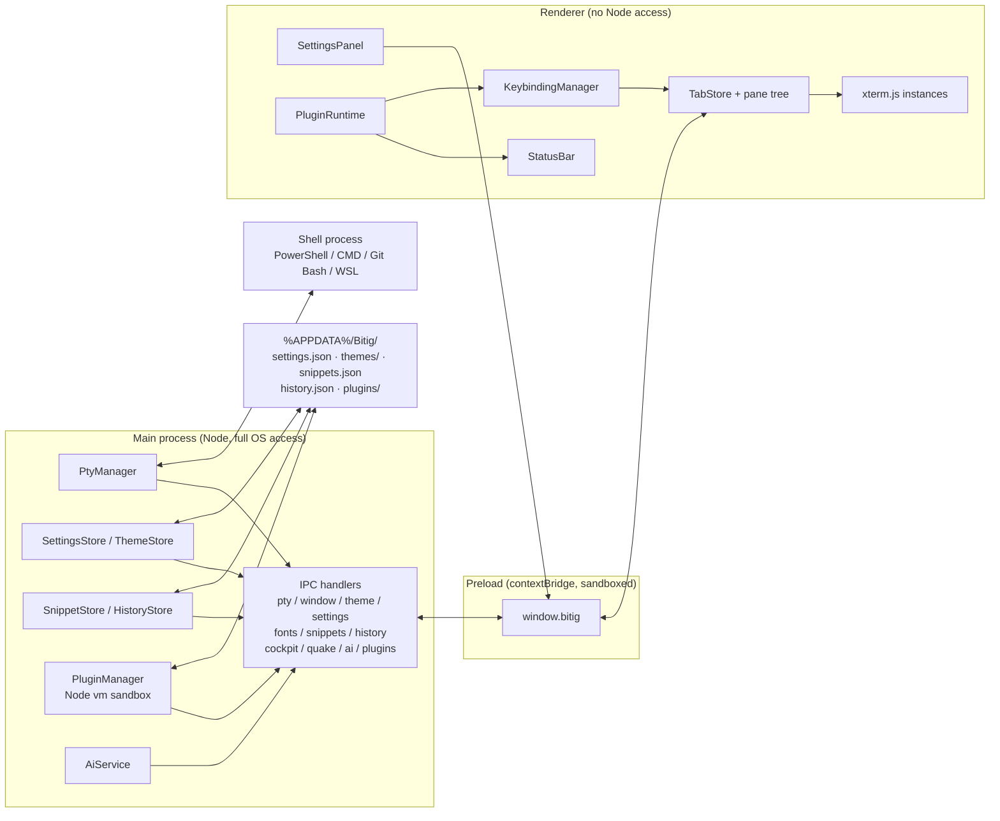

<div align="center">


<h1>Bitig</h1>

<p>
<b>A terminal emulator for Windows, built from scratch.</b><br />
<sub>Sifirdan yazilan, Windows icin bir terminal emulatoru.</sub>
</p>

[](CHANGELOG.md)
[](#installation)
[](https://www.electronjs.org/)
[](tsconfig.json)
[](#license)

<p>
<a href="#english"><b>English</b></a>
&nbsp;·&nbsp;
<a href="#turkce"><b>Turkce</b></a>
&nbsp;·&nbsp;
<a href="CHANGELOG.md">Changelog</a>
&nbsp;·&nbsp;
<a href="ROADMAP.md">Roadmap</a>
&nbsp;·&nbsp;
<a href="FEATURES.md">Features</a>
</p>

<table>
<tr>
<td align="center" width="25%"><sub><b>Inline Suggestions</b></sub><br /><sub>Ghost text from history<br />and project context</sub></td>
<td align="center" width="25%"><sub><b>Developer Cockpit</b></sub><br /><sub>Live ports, smart links,<br />secret masking</sub></td>
<td align="center" width="25%"><sub><b>Local AI</b></sub><br /><sub>Ollama or BYOK,<br />zero telemetry</sub></td>
<td align="center" width="25%"><sub><b>Plugin Runtime</b></sub><br /><sub>Sandboxed Node VM,<br />manifest based</sub></td>
</tr>
</table>

</div>

---

<a id="english"></a>

## English

### Contents

| | |
|---|---|
| [About](#about) | What Bitig is and is not |
| [Installation](#installation) | Setup installer and portable build |
| [Feature Overview](#feature-overview) | Everything shipped in 1.0.3 |
| [Tech Stack](#tech-stack) | Layers and why each was chosen |
| [Architecture](#architecture) | Process boundaries and data flow |
| [IPC Channel Reference](#ipc-channel-reference) | The full typed contract |
| [Keyboard Shortcuts](#keyboard-shortcuts) | Default bindings |
| [Customization](#customization) | Settings, themes, snippets, plugins |
| [Building From Source](#building-from-source) | Dev and release builds |
| [Project Structure](#project-structure) | Where everything lives |
| [Contributing](#contributing) | Working on the project |

### About

Bitig is a desktop terminal emulator written from the ground up for Windows 11
as an alternative to Windows Terminal. It is not a fork, a theme, or a shell
on top of an existing terminal. It is its own Electron application with its
own window chrome, its own rendering pipeline, its own settings format, and
its own plugin runtime.

The goal is a **Developer Cockpit**: a terminal that stops being a passive text
stream and becomes an interactive workstation. Clickable port badges, smart
file hyperlinks, automatic secret masking, parametric runbooks, frecency
ranked command history, a sandboxed plugin system, and a Quake style HUD mode.

Everything runs locally. Zero cloud dependency, zero telemetry, no account.
All state lives in plain JSON under `%APPDATA%/Bitig/`.

### Installation

Download the latest release for Windows 11 x64:

| Build | File | Notes |
|---|---|---|
| **Setup** | `Bitig-Setup-1.0.3.exe` | NSIS installer. Choose install directory, creates Start Menu and desktop shortcuts. |
| **Portable** | `Bitig-Portable-1.0.3.exe` | Single self contained executable. No installation, no registry writes. |

Both builds are x64 only and require Windows 11. No runtime prerequisites:
Node.js, Electron and the native ConPTY bindings are bundled.

### Feature Overview

<table>
<tr><th align="left" width="34%">Area</th><th align="left">Capability</th></tr>
<tr>
<td valign="top"><b>Terminal core</b></td>
<td>Real shell processes (PowerShell, CMD, Git Bash, WSL distributions) spawned through ConPTY via <code>node-pty</code>. Auto discovery of installed shells at startup. Configurable scrollback depth up to 50,000 lines. Copy on select, paste on right click, and a glassmorphic right click context menu.</td>
</tr>
<tr>
<td valign="top"><b>Inline suggestions</b></td>
<td>Fish style ghost text as you type. Only true prefix matches are ever suggested, ranked by frecency (recency, run count, same working directory, and a penalty for commands that failed), then by project context: <code>package.json</code> scripts across <code>npm</code>/<code>pnpm</code>/<code>yarn</code>/<code>bun</code>, <code>Makefile</code> targets, and directory or file names for the argument of path commands (<code>cd</code>, <code>code</code>, <code>cat</code>, <code>rm</code> and friends). <code>Tab</code> accepts the whole suggestion, <code>Ctrl</code>/<code>Alt</code>+<code>→</code> accepts one word at a time, <code>Esc</code> dismisses, and when there is no suggestion <code>Tab</code> falls through to the shell's own completion untouched.</td>
</tr>
<tr>
<td valign="top"><b>Windows and tabs</b></td>
<td>Launching Bitig again opens a new, fully independent window (<code>Ctrl+Shift+N</code>) with its own tabs and shell processes; closing the last one exits the process completely. Tabs drag to reorder, middle click to close, double click to rename, and retitle themselves to the current working directory as you <code>cd</code>, via automatic shell integration (OSC 7).</td>
</tr>
<tr>
<td valign="top"><b>Panes</b></td>
<td>Split panes nest arbitrarily, the divider is draggable, and any pane can be zoomed to full area. Confirm before closing an active session, plus session restore on launch.</td>
</tr>
<tr>
<td valign="top"><b>Appearance</b></td>
<td>Four built in themes (Bitig Dark, Bitig Light, Dracula, Nord) plus hot reloaded user themes. Window transparency, background image with independent opacity and fit, and a font picker that <i>measures</i> Nerd Font glyph coverage on a canvas instead of guessing from the family name.</td>
</tr>
<tr>
<td valign="top"><b>Developer Cockpit</b></td>
<td>Live Port Sniffer detects dev servers in the PTY stream and renders clickable badges. Smart Links turn <code>src/main.ts:42:15</code> into a one click jump into VS Code or Cursor at the exact line. Secret Shield masks tokens (<code>sk-</code>, <code>ghp_</code>, <code>AKIA</code>, bearer tokens, private keys) before anything reaches the history store.</td>
</tr>
<tr>
<td valign="top"><b>Command surfaces</b></td>
<td>Universal Command Palette with fuzzy search across actions, tabs, profiles and themes. Bitig Betik parametric runbooks with <code>{{variable}}</code> placeholders and a generated form. Cross session command history ranked by frecency. In terminal incremental search with regex, case and whole word toggles.</td>
</tr>
<tr>
<td valign="top"><b>Bitig Bilge (AI)</b></td>
<td>Natural language to shell command, plus error explanation. Runs fully local against Ollama, or bring your own key for OpenAI, Anthropic, Gemini, DeepSeek, and any OpenAI compatible endpoint. Keys never leave <code>settings.json</code>.</td>
</tr>
<tr>
<td valign="top"><b>Power modes</b></td>
<td>Quake / dropdown HUD window bound to a global OS shortcut. Broadcast Input mirrors keystrokes into every split pane of the active tab, with an unmistakable synchronization banner.</td>
</tr>
<tr>
<td valign="top"><b>Extensibility</b></td>
<td>Manifest based plugins loaded from <code>%APPDATA%/Bitig/plugins/</code>, executed inside an isolated Node <code>vm</code> context with an explicitly allowlisted <code>bitig</code> API. Plugins can contribute status bar widgets and rebindable actions. Three reference plugins ship out of the box.</td>
</tr>
<tr>
<td valign="top"><b>Chrome</b></td>
<td>Frameless custom window with rounded corners, a compact 36px title bar that hosts the tab strip inline, and a bottom status bar with profile, pane index, live ports, encoding, cursor position and plugin widgets.</td>
</tr>
</table>

### Tech Stack

| Layer | Choice | Why |
|---|---|---|
| App shell | [Electron](https://www.electronjs.org/) 43 | Mature desktop packaging and native OS integration on Windows |
| Build tooling | [electron-vite](https://electron-vite.org/) | Separate, sane build pipelines for main, preload and renderer |
| Terminal rendering | `@xterm/xterm` + fit, web-links, search | De facto standard terminal renderer for web and Electron apps |
| Shell processes | `node-pty` | Real ConPTY backed shells on Windows, N-API prebuilt binaries |
| Language | TypeScript (strict) | Type safety across process boundaries, catches IPC contract drift |
| Packaging | `electron-builder` | NSIS installer and portable target from one config |

### Architecture

Three isolated processes, talking only through a narrow typed IPC surface.
The renderer never touches Node or native modules directly.



Every tab owns a pane tree (`src/renderer/src/panes.ts`): a single leaf by
default, or a nested tree of splits. Every leaf maps to exactly one
`PtyManager` session and one `xterm.js` instance. `TabStore` dispatches PTY
events to the correct leaf, feeds output into `PortSniffer` and
`ExecutionTelemetry`, and keeps the status bar in sync. `KeybindingManager`
owns a central action registry and resolves every shortcut, which is what
makes both user rebinding and plugin contributed actions possible without
touching the calling code.

### IPC Channel Reference

Naming convention is `<domain>:<action>`. Each channel is declared once in
`src/shared/*.ts` and consumed by main, preload and renderer alike, so the
contract cannot silently drift between processes.

<details>
<summary><b>PTY and window</b></summary>

| Channel | Direction | Kind | Purpose |
|---|---|---|---|
| `pty:create` | renderer to main | invoke | Start a new PTY session, returns its id |
| `pty:write` | renderer to main | send | Forward keyboard input to the shell |
| `pty:resize` | renderer to main | send | Resize the PTY when the terminal is resized |
| `pty:dispose` | renderer to main | send | Kill a PTY session (tab or pane closing) |
| `pty:data` | main to renderer | event | Shell output chunk |
| `pty:exit` | main to renderer | event | Shell process exited |
| `window:minimize` | renderer to main | send | Minimize the window |
| `window:toggle-maximize` | renderer to main | send | Maximize or restore |
| `window:close` | renderer to main | send | Close the window |
| `window:is-maximized` | renderer to main | invoke | Query current maximize state |
| `window:maximize-change` | main to renderer | event | Maximize state changed |
| `window:notify` | renderer to main | send | Fire a native Windows desktop notification |
| `window:new-window` | renderer to main | send | Open a new, fully independent Bitig window |

All `pty:*` and `window:*` handlers are registered once per application and
resolve their target window from `event.sender`, so several windows can share
the same channels; `pty:data` and `pty:exit` are sent only to the window that
owns the session.

</details>

<details>
<summary><b>Appearance and settings</b></summary>

| Channel | Direction | Kind | Purpose |
|---|---|---|---|
| `theme:list` | renderer to main | invoke | Return every built in and user theme |
| `theme:list-changed` | main to renderer | event | A file in `themes/` was added, removed or edited |
| `settings:get` | renderer to main | invoke | Return the current settings object |
| `settings:set` | renderer to main | send | Apply a partial update (deep merged) |
| `settings:changed` | main to renderer | event | Broadcast full settings after any change |
| `settings:read-background-image` | renderer to main | invoke | Return background image as a `data:` URL |
| `settings:pick-background-image` | renderer to main | invoke | Open the native file picker |
| `settings:reset` | renderer to main | send | Reset all settings to defaults |
| `fonts:list` | renderer to main | invoke | List installed font families (cached) |

</details>

<details>
<summary><b>Productivity surfaces</b></summary>

| Channel | Direction | Kind | Purpose |
|---|---|---|---|
| `snippets:list` | renderer to main | invoke | List all runbook snippets |
| `snippets:save` | renderer to main | invoke | Create or update a snippet |
| `snippets:delete` | renderer to main | invoke | Delete a snippet by id |
| `snippets:reset` | renderer to main | invoke | Reset to the built in snippet library |
| `history:list` | renderer to main | invoke | List command history, frecency sorted |
| `history:add` | renderer to main | invoke | Record a completed command |
| `history:clear` | renderer to main | invoke | Clear all history |
| `cockpit:open-url` | renderer to main | invoke | Open a URL in the default browser |
| `cockpit:open-file` | renderer to main | invoke | Open a file in the configured editor at a line |
| `completion:context` | renderer to main | invoke | Project context for inline suggestions (`package.json` scripts, `Makefile` targets, directory entries), cached per directory by mtime |

</details>

<details>
<summary><b>Modes, AI and plugins</b></summary>

| Channel | Direction | Kind | Purpose |
|---|---|---|---|
| `quake:toggle` | renderer to main | invoke | Toggle the Quake HUD dropdown window |
| `quake:set-hotkey` | renderer to main | invoke | Rebind the global Quake OS shortcut |
| `ai:prompt` | renderer to main | invoke | Generate a CLI command from a natural language prompt |
| `ai:explain-error` | renderer to main | invoke | Explain a terminal error and suggest a resolution |
| `ai:test-connection` | renderer to main | invoke | Test connectivity to the configured AI endpoint |
| `plugin:list` | renderer to main | invoke | List discovered plugins with state and errors |
| `plugin:toggle` | renderer to main | invoke | Enable or disable a plugin |
| `plugin:reload` | renderer to main | invoke | Rescan and hot reload the plugins directory |
| `plugin:get-contributions` | renderer to main | invoke | Return status bar widgets and actions contributed by plugins |
| `plugin:contributions` | main to renderer | event | Broadcast contributions after a plugin updates a widget |
| `plugin:open-dir` | renderer to main | send | Open the plugins folder in Explorer |
| `plugin:execute-action` | renderer to main | send | Run a plugin registered action by id |

</details>

### Keyboard Shortcuts

Every binding below is rebindable from **Settings > Keyboard**, with live
conflict detection and a per shortcut reset.

<table>
<tr><td valign="top" width="50%">

**Tabs and panes**

| Shortcut | Action |
|---|---|
| `Ctrl+Shift+N` | New window |
| `Ctrl+Shift+T` | New tab |
| `Ctrl+Shift+W` | Close active tab |
| `Ctrl+Tab` / `Ctrl+Shift+Tab` | Next / previous tab |
| `Ctrl+Shift+1..9` | Open tab with profile 1 to 9 |
| `Alt+Shift+D` | Split focused pane right |
| `Alt+Shift+E` | Split focused pane down |
| `Ctrl+Shift+X` | Close focused pane |
| `Ctrl+Shift+Z` | Zoom / unzoom focused pane |
| `Alt+Arrow` / `Alt+H/J/K/L` | Navigate between panes |

</td><td valign="top" width="50%">

**Surfaces and modes**

| Shortcut | Action |
|---|---|
| `Ctrl+Shift+P` | Command Palette |
| `Ctrl+Shift+B` | Bitig Betik (runbooks) |
| `Ctrl+R` | Fuzzy command history |
| `Ctrl+F` | In terminal search |
| `Ctrl+I` | Bitig Bilge (AI) |
| `Ctrl+,` | Toggle settings panel |
| `Alt+Shift+T` | Cycle themes |
| `Alt+Shift+I` | Toggle Broadcast Input |
| `Win+~` / `Ctrl+~` | Quake HUD window |
| `Tab` | Accept the inline suggestion |
| `Ctrl`/`Alt`+`Right` | Accept the suggestion one word at a time |

</td></tr>
</table>

Mouse conveniences: middle click a tab to close it, drag to reorder, double
click a tab title to rename inline, right click the terminal for the context
menu, and click a port badge to open `localhost:PORT` in the browser.

### Customization

#### Settings panel

Press `Ctrl+,` or click the gear in the title bar. Seven sections:
**Appearance**, **Terminal**, **Keyboard**, **Bitig Bilge**, **Cockpit**,
**Notifications**, and **Plugins**. Everything the panel writes is plain JSON,
so nothing is locked behind the GUI.

#### Settings file

`%APPDATA%/Bitig/settings.json` is the source of truth. Hand editing works
identically to using the panel: changes are picked up within milliseconds via
`fs.watch`, debounced so a half written file never clobbers in memory state.

```jsonc
{
  "schemaVersion": 1,
  "activeTheme": "nord",
  "defaultProfileId": "powershell",
  "appearance": {
    "opacity": 0.92,
    "backgroundImage": "C:\\Users\\you\\Pictures\\bg.png",
    "backgroundImageOpacity": 0.25,
    "backgroundImageFit": "cover"
  },
  "terminal": {
    "fontFamily": "MesloLGS Nerd Font",
    "fontSize": 14,
    "scrollback": 10000,
    "copyOnSelect": true,
    "pasteOnRightClick": false,
    "confirmBeforeClose": true,
    "restoreSession": true,
    "showStatusBar": true
  },
  "telemetry": {
    "enableNotifications": true,
    "notificationThresholdMs": 5000
  },
  "cockpit": {
    "enablePortSniffer": true,
    "enableSecretShield": true,
    "openLinksInEditor": true
  }
}
```

#### Themes

Four themes ship built in: `bitig-dark` (default), `bitig-light`, `dracula`,
`nord`. Drop a custom JSON file into `%APPDATA%/Bitig/themes/` and it appears
immediately, no restart. The schema mirrors the xterm.js theme fields (all 16
ANSI colors plus background, foreground, cursor and selection) plus a `ui`
block for the window chrome.

#### Snippets

Built in runbooks live in the app bundle; your own are stored in
`%APPDATA%/Bitig/snippets.json`. Use `{{variable_name}}` placeholders in the
`template` field and the Bitig Betik modal renders them as an interactive form
with a live command preview.

#### Plugins

Each plugin is a folder under `%APPDATA%/Bitig/plugins/<id>/` containing a
`plugin.json` manifest and an entry script. The script runs inside an isolated
Node `vm` context with no filesystem or process globals; only the declared
`bitig` API is reachable.

```jsonc
{
  "id": "git-status",
  "name": "Git Branch Sentinel",
  "version": "1.0.3",
  "description": "Shows the active Git branch in the status bar.",
  "author": "Bitig Team",
  "main": "main.js",
  "permissions": ["statusbar"]
}
```

```js
function updateGit() {
  const branch = bitig.getGitBranch();
  bitig.ui.setStatusBarWidget({
    id: 'git-branch',
    label: branch || 'Git',
    tooltip: 'Active Git branch',
    color: '#86efac'
  });
}

updateGit();
bitig.setInterval(updateGit, 2500);
```

Available surface: `bitig.ui.setStatusBarWidget`, `bitig.actions.register`,
`bitig.getGitBranch`, `bitig.getSystemMemory`, `bitig.openUrl`,
`bitig.setInterval`.

### Building From Source

Requires Windows 11, Node.js 20 or newer, and npm.

```
git clone https://github.com/sametgurtuna/bitig.git
cd bitig
npm install
```

| Command | Result |
|---|---|
| `npm run dev` | Vite dev server for the renderer plus a hot reloading Electron window |
| `npm run typecheck` | Strict TypeScript check across main, preload and renderer |
| `npm run build` | Production bundles under `out/` |
| `npm run pack` | Unpacked app directory under `dist/win-unpacked/` |
| `npm run dist` | Both Windows targets: NSIS setup and portable executable |
| `npm run dist:portable` | Portable executable only |

#### Code signing

Release builds are signed when a certificate is supplied through the standard
electron-builder environment variables; without them the build still completes,
unsigned.

```powershell
# One time: create a local self signed certificate under build/ (gitignored)
.\scripts\make-cert.ps1

$env:CSC_LINK = "$PWD\build\bitig-codesign.pfx"
$env:CSC_KEY_PASSWORD = "<password>"
npm run dist
```

The signature and the `publisherName` in `electron-builder.yml` make **Samet
Gurtuna** the publisher shown in the installer and in Apps & Features. Note that
a self signed certificate does **not** remove the SmartScreen warning on first
run: Windows only trusts it if the certificate is imported into the machine's
Trusted Root store (`.\scripts\make-cert.ps1 -TrustLocally`, requires
administrator), and even a properly signed build needs to accumulate SmartScreen
reputation. Silencing it for everyone requires a commercial OV or EV code
signing certificate.

### Project Structure

```
Bitig/
  electron-builder.yml        Windows packaging targets (nsis + portable), publisher
  electron.vite.config.ts     Build config for main / preload / renderer
  assets/                     App icon set and README banner
  scripts/make-cert.ps1       Generates a local self signed code signing certificate
  src/
    shared/                   Typed IPC contracts, shared by all processes
      ptyTypes.ts               PTY channels
      windowTypes.ts            Window control channels
      themeTypes.ts             BitigTheme schema + theme channels
      settingsTypes.ts          BitigSettings schema + settings channels
      fontTypes.ts              Font enumeration channel
      snippetTypes.ts           Snippet schema + built in runbook library
      historyTypes.ts           History entry schema
      cockpitTypes.ts           DiscoveredPort + cockpit settings
      actionTypes.ts            Central action registry, default keybindings
      profileTypes.ts           ShellProfile schema + defaults
      quakeTypes.ts             Quake HUD settings
      aiTypes.ts                AI provider settings + prompt contracts
      pluginTypes.ts            Plugin manifest + contribution contracts
      completionTypes.ts        Inline suggestion project context contract
      builtinThemes/            bitigDark / bitigLight / dracula / nord
    main/
      index.ts                  App lifecycle, multi window management, clean shutdown
      pty/                      PTY session manager, shell auto discovery
        shellIntegration.ts     Injects the OSC 7 prompt hook per shell
      theme/                    Theme store, watches themes/
      settings/                 Settings store, watches settings.json
      snippets/ history/        Runbook and command history stores
      plugins/pluginManager.ts  Discovery, vm sandbox, reference plugin seeding
      ai/aiService.ts           Multi provider AI client (fetch based)
      ipc/                      One handler module per domain
    preload/
      index.ts                  contextBridge surface: window.bitig
    renderer/
      index.html
      src/
        main.ts                 Bootstrap, wires every top level module
        tabs.ts                 TabStore: tabs, pane routing, context menus
        panes.ts                Pane tree: split / close / render, divider drag
        appearance.ts           Applies theme, opacity, background image
        settingsPanel.ts        Settings GUI
        statusBar.ts            Bottom status bar and plugin widget host
        keybindings.ts          Action registry resolution, conflict detection
        commandPalette.ts       Ctrl+Shift+P
        betikModal.ts           Ctrl+Shift+B runbooks
        historyModal.ts         Ctrl+R history search
        bilgeModal.ts           Ctrl+I AI companion
        searchBar.ts            Ctrl+F in terminal search
        contextMenu.ts          Right click menu
        confirmModal.ts         Confirm before destructive close
        sessionManager.ts       Session persistence and restore
        pluginRuntime.ts        Bridges plugin contributions into the UI
        autocomplete.ts         Inline ghost text suggestion engine and overlay
        cwdTracker.ts           Prompt based working directory fallback
        portSniffer.ts          Live port detection from the PTY stream
        smartLinks.ts           file:line:col link provider
        secretShield.ts         Sensitive token detection and masking
        telemetry.ts            Command duration tracking and notifications
        fonts.ts                Monospace filtering and Nerd Font glyph probing
        fuzzy.ts                Fuzzy match scoring
        icons.ts                Single stroke SVG icon set
        titlebar.ts             Custom title bar behavior
        style.css               All UI styles
```

### Contributing

Fork the repository, keep each commit focused on one concern, and write commit
messages in English following the existing style. Run `npm run typecheck`
before opening a pull request. Architectural notes and per milestone design
records live in [`ROADMAP.md`](ROADMAP.md) and `CLAUDE.md`.

### Naming

"Bitig" is an Old Turkic word meaning "writing" or "written text". The name
follows the same tradition as the author's other projects, which draw on
Turkic mythology and Old Turkic vocabulary.

<div align="right"><a href="#bitig">Back to top</a></div>

---

<a id="turkce"></a>

## Turkce

### Icindekiler

| | |
|---|---|
| [Proje Hakkinda](#proje-hakkinda) | Bitig ne, ne degil |
| [Kurulum](#kurulum) | Setup ve portable dagitimlari |
| [Ozellikler](#ozellikler) | 1.0.3 ile gelen her sey |
| [Teknik Yigin](#teknik-yigin) | Katmanlar ve tercih gerekceleri |
| [Klavye Kisayollari](#klavye-kisayollari-1) | Varsayilan kisayollar |
| [Ozellestirme](#ozellestirme) | Ayarlar, temalar, betikler, eklentiler |
| [Kaynaktan Derleme](#kaynaktan-derleme) | Gelistirme ve surum derlemeleri |

### Proje Hakkinda

Bitig, Windows 11 icin sifirdan yazilan, Windows Terminal'e alternatif bir
masaustu terminal emulatoru. Var olan bir terminale eklenen tema ya da fork
degil; kendi pencere govdesi, kendi render hatti, kendi ayar formati ve kendi
eklenti calisma ortamiyla bagimsiz bir Electron uygulamasi.

Hedef bir **Gelistirici Kokpiti**: pasif bir metin akisi olmaktan cikip
etkilesimli bir calisma istasyonuna donusen bir terminal. Tiklanabilir port
rozetleri, akilli dosya hiperlinkleri, otomatik sifre maskeleme, parametrik
runbook'lar, frecency sirali komut gecmisi, korumali alanda calisan bir
eklenti sistemi ve Quake tarzi HUD modu.

Her sey yerelde calisir. Sifir bulut bagimliligi, sifir telemetri, hesap yok.
Tum durum `%APPDATA%/Bitig/` altinda duz JSON olarak tutulur.

### Kurulum

Windows 11 x64 icin son surum:

| Dagitim | Dosya | Not |
|---|---|---|
| **Setup** | `Bitig-Setup-1.0.3.exe` | NSIS kurulum sihirbazi. Kurulum dizini secilebilir, Baslat menusu ve masaustu kisayolu olusturur. |
| **Portable** | `Bitig-Portable-1.0.3.exe` | Tek dosyalik bagimsiz calistirilabilir. Kurulum yok, kayit defterine yazmaz. |

Iki dagitim da yalnizca x64 ve Windows 11 icindir. On kosul yoktur: Node.js,
Electron ve native ConPTY baglayicilari paketin icinde gelir.

### Ozellikler

| Alan | Yetenek |
|---|---|
| **Terminal cekirdegi** | `node-pty` uzerinden ConPTY ile gercek shell prosesleri (PowerShell, CMD, Git Bash, WSL). Kurulu kabuklarin baslangicta otomatik tespiti. 50.000 satira kadar ayarlanabilir gecmis tamponu. Secince kopyala, sag tikla yapistir ve cam efektli sag tik menusu. |
| **Akilli tamamlama** | Yazarken beliren seffaf (ghost) komut onerisi; frecency sirali komut gecmisi, proje baglami (`package.json` script'leri, `Makefile` hedefleri, `cd` sonrasi alt klasorler) ve yerlesik komut sozlugunden beslenir. `Tab` kabul eder, `Esc` kapatir; oneri yokken `Tab` dogrudan kabuga gider, kabugun kendi tamamlamasi bozulmaz. |
| **Pencereler ve sekmeler** | Bitig'i tekrar calistirmak yeni ve tamamen bagimsiz bir pencere acar (`Ctrl+Shift+N`); her pencerenin kendi sekmeleri ve shell prosesleri vardir, son pencere kapatilinca uygulama tamamen sonlanir. Sekmeler suruklenip siralanir, orta tikla kapanir, cift tikla yeniden adlandirilir ve kabuk entegrasyonu (OSC 7) sayesinde `cd` yaptikca calisma dizinine gore anlik olarak yeniden adlandirilir. |
| **Pane'ler** | Split pane'ler ic ice bolunebilir, divider suruklenebilir, herhangi bir pane tam alana buyutulebilir. Aktif oturum kapatilirken onay ve acilista oturum geri yukleme. |
| **Gorunum** | Dort hazir tema (Bitig Dark, Bitig Light, Dracula, Nord) ve aninda yuklenen kullanici temalari. Pencere seffafligi, bagimsiz opaklik ve yerlesime sahip arkaplan gorseli, font ailesinin adina bakmak yerine canvas uzerinde Nerd Font glyph kapsamini *olcen* font secici. |
| **Gelistirici Kokpiti** | Canli Port Dinleyicisi PTY akisindaki dev sunucularini tespit edip tiklanabilir rozetler cizer. Akilli Linkler `src/main.ts:42:15` ifadesini tek tikla VS Code veya Cursor'da tam satira atlayan bir baglantiya cevirir. Secret Shield token'lari (`sk-`, `ghp_`, `AKIA`, bearer, ozel anahtarlar) gecmise yazilmadan once maskeler. |
| **Komut yuzeyleri** | Aksiyonlar, sekmeler, profiller ve temalar uzerinde fuzzy arama yapan Evrensel Komut Paleti. `{{degisken}}` yer tutuculu ve otomatik form ureten Bitig Betik runbook'lari. Oturumlar arasi, frecency sirali komut gecmisi. Regex, buyuk/kucuk harf ve tam kelime secenekli terminal ici artimli arama. |
| **Bitig Bilge (AI)** | Dogal dilden shell komutu uretme ve hata analizi. Ollama ile tamamen yerel calisir; ya da OpenAI, Anthropic, Gemini, DeepSeek ve OpenAI uyumlu herhangi bir uc nokta icin kendi anahtarinizi kullanin. Anahtarlar `settings.json` disina cikmaz. |
| **Guc modlari** | Global sistem kisayoluna bagli Quake / acilir HUD penceresi. Broadcast Input, aktif sekmedeki tum split pane'lere ayni tuslari yansitir ve goz ardi edilemeyecek bir senkronizasyon banner'i gosterir. |
| **Genisletilebilirlik** | `%APPDATA%/Bitig/plugins/` altindan yuklenen manifest tabanli eklentiler, izole bir Node `vm` baglaminda ve yalnizca acikca izin verilen `bitig` API'siyle calisir. Eklentiler durum cubugu bileseni ve yeniden atanabilir aksiyon ekleyebilir. Uc referans eklenti hazir gelir. |
| **Pencere govdesi** | Yuvarlatilmis koseli cercevesiz pencere, sekme seridini icinde barindiran 36px'lik kompakt title bar ve profil, pane indeksi, canli portlar, kodlama, imlec konumu ve eklenti bilesenlerini gosteren alt durum cubugu. |

### Teknik Yigin

| Katman | Secim | Neden |
|---|---|---|
| Uygulama kabugu | Electron 43 | Olgun masaustu paketleme, Windows'ta native entegrasyon |
| Build araci | electron-vite | Main / preload / renderer icin ayri build hatlari |
| Terminal render | `@xterm/xterm` + eklentiler | Web ve Electron'da fiili standart terminal render motoru |
| Shell proses yonetimi | `node-pty` | Windows'ta gercek ConPTY tabanli prosesler, hazir N-API binary'leri |
| Dil | TypeScript (strict) | Proses sinirlari arasinda tip guvenligi, IPC sozlesmesi kaymasini yakalar |
| Paketleme | `electron-builder` | Tek konfigurasyondan NSIS kurulum ve portable hedefi |

IPC kanallarinin tam listesi icin [English](#ipc-channel-reference) bolumune bakin.

### Klavye Kisayollari

Asagidaki tum kisayollar **Ayarlar > Klavye** bolumunden, canli catisma
tespiti ve kisayol basina sifirlama ile yeniden atanabilir.

<table>
<tr><td valign="top" width="50%">

**Sekmeler ve pane'ler**

| Kisayol | Eylem |
|---|---|
| `Ctrl+Shift+N` | Yeni pencere |
| `Ctrl+Shift+T` | Yeni sekme |
| `Ctrl+Shift+W` | Aktif sekmeyi kapat |
| `Ctrl+Tab` / `Ctrl+Shift+Tab` | Sonraki / onceki sekme |
| `Ctrl+Shift+1..9` | 1-9 numarali profille sekme ac |
| `Alt+Shift+D` | Odakli pane'i saga bol |
| `Alt+Shift+E` | Odakli pane'i asagiya bol |
| `Ctrl+Shift+X` | Odakli pane'i kapat |
| `Ctrl+Shift+Z` | Odakli pane'i buyut / geri al |
| `Alt+Yon` / `Alt+H/J/K/L` | Pane'ler arasi gecis |

</td><td valign="top" width="50%">

**Yuzeyler ve modlar**

| Kisayol | Eylem |
|---|---|
| `Ctrl+Shift+P` | Komut Paleti |
| `Ctrl+Shift+B` | Bitig Betik (runbook'lar) |
| `Ctrl+R` | Fuzzy komut gecmisi |
| `Ctrl+F` | Terminal ici arama |
| `Ctrl+I` | Bitig Bilge (AI) |
| `Ctrl+,` | Ayarlar panelini ac/kapat |
| `Alt+Shift+T` | Tema dongusu |
| `Alt+Shift+I` | Broadcast Input ac/kapat |
| `Win+~` / `Ctrl+~` | Quake HUD penceresi |
| `Tab` | Satir ici oneriyi kabul et |
| `Ctrl`/`Alt`+`Sag` | Oneriyi kelime kelime kabul et |

</td></tr>
</table>

Fare kolayliklari: sekmeye orta tiklayarak kapatma, surukleyerek siralama,
sekme basligina cift tiklayip yerinde yeniden adlandirma, terminale sag
tiklayarak baglam menusu ve port rozetine tiklayarak `localhost:PORT`
adresini tarayicida acma.

### Ozellestirme

**Ayarlar paneli.** `Ctrl+,` ya da title bar'daki disli. Yedi bolum:
Gorunum, Terminal, Klavye, Bitig Bilge, Kokpit, Bildirimler ve Eklentiler.
Panelin yazdigi her sey duz JSON'dur, hicbir sey GUI'nin arkasinda kilitli
degildir.

**Ayarlar dosyasi.** `%APPDATA%/Bitig/settings.json` gercek kaynaktir. Elle
duzenleme paneli kullanmakla ayni sekilde calisir: degisiklikler `fs.watch`
ile milisaniyeler icinde alinir, yarim yazilmis bir dosyanin bellekteki
durumu bozmamasi icin debounce edilir. Ornek icin
[English](#settings-file) bolumune bakin.

**Temalar.** `%APPDATA%/Bitig/themes/` altina ozel bir JSON birakin, yeniden
baslatmadan aninda gorunur.

**Betikler.** `%APPDATA%/Bitig/snippets.json` icinde saklanir. `template`
alanina `{{degisken_adi}}` yer tutuculari ekleyin; Bitig Betik bunlari canli
onizlemeli etkilesimli bir forma cevirir.

**Eklentiler.** Her eklenti `%APPDATA%/Bitig/plugins/<id>/` altinda bir
`plugin.json` manifesti ve bir giris betiginden olusur. Betik, dosya sistemi
ve proses global'leri olmayan izole bir Node `vm` baglaminda calisir; yalnizca
tanimli `bitig` API'sine erisebilir.

### Kaynaktan Derleme

Windows 11, Node.js 20 veya uzeri ve npm gerekir.

```
git clone https://github.com/sametgurtuna/bitig.git
cd bitig
npm install
```

| Komut | Sonuc |
|---|---|
| `npm run dev` | Renderer icin Vite dev sunucusu ve sicak yeniden yuklemeli Electron penceresi |
| `npm run typecheck` | Main, preload ve renderer icin strict TypeScript denetimi |
| `npm run build` | `out/` altinda uretim paketleri |
| `npm run pack` | `dist/win-unpacked/` altinda paketlenmemis uygulama dizini |
| `npm run dist` | Iki Windows hedefi: NSIS kurulum ve portable calistirilabilir |
| `npm run dist:portable` | Yalnizca portable calistirilabilir |

#### Kod imzalama

Sertifika `CSC_LINK` / `CSC_KEY_PASSWORD` ortam degiskenleriyle verildiginde
build imzalanir; verilmezse build imzasiz tamamlanir.

```powershell
# Tek seferlik: build/ altinda yerel self-signed sertifika uret (gitignore'da)
.\scripts\make-cert.ps1

$env:CSC_LINK = "$PWD\build\bitig-codesign.pfx"
$env:CSC_KEY_PASSWORD = "<sifre>"
npm run dist
```

Imza ve `electron-builder.yml` icindeki `publisherName`, kurulum sihirbazinda
ve "Uygulamalar ve Ozellikler" listesinde yayinci adini **Samet Gurtuna**
yapar. Ancak self-signed sertifika SmartScreen uyarisini kaldirmaz: Windows bu
sertifikaya ancak Trusted Root deposuna eklenirse guvenir
(`.\scripts\make-cert.ps1 -TrustLocally`, yonetici gerekir) ve duzgun imzali
bir build bile SmartScreen itibari biriktirene kadar uyari gosterebilir.
Uyarinin herkeste kalkmasi icin ticari bir OV/EV kod imzalama sertifikasi
gerekir.

### Katkida Bulunma

Repoyu fork'layin, her commit'i tek bir konuya odaklayin ve commit
mesajlarini Ingilizce yazin. Pull request acmadan once `npm run typecheck`
calistirin.

### Isim Hakkinda

"Bitig", Eski Turkce'de "yazi" ya da "yazili metin" anlamina gelir.

<div align="right"><a href="#bitig">Basa don</a></div>

---

<div align="center" id="license">

**License / Lisans:** [MIT](LICENSE) &nbsp;·&nbsp; Copyright (c) 2026 Samet Gurtuna

</div>
