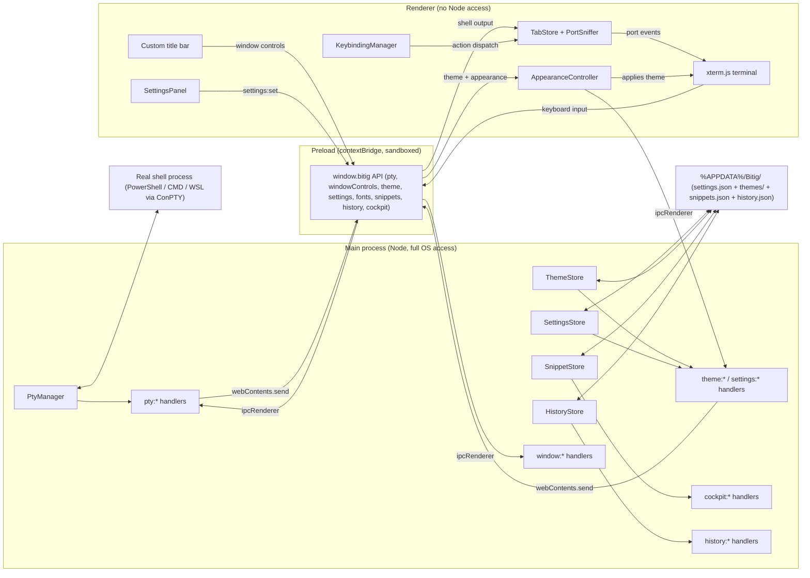

<div align="center">


# Bitig

**A terminal emulator for Windows, built from scratch.**  
**Sifirdan yazilan, Windows icin bir terminal emulatoru.**

[](#)
[](#)
[](#)
[](#)
[](#)
[](#)
[](#license--lisans)

**[English](#english)** &nbsp;|&nbsp; **[Turkce](#turkce)** &nbsp;|&nbsp; [Changelog](CHANGELOG.md) &nbsp;|&nbsp; [Roadmap](ROADMAP.md) &nbsp;|&nbsp; [Features](FEATURES.md)

</div>

---

<a id="english"></a>

# English

## Table of Contents

- [About](#about)
- [Features](#features)
- [Tech Stack](#tech-stack)
- [Architecture](#architecture)
- [IPC Channel Reference](#ipc-channel-reference)
- [Getting Started](#getting-started)
- [Keyboard Shortcuts](#keyboard-shortcuts)
- [Customization](#customization)
- [Project Structure](#project-structure)
- [Roadmap](#roadmap)
- [Contributing](#contributing)
- [Naming](#naming)

## About

Bitig is a desktop terminal emulator built for Windows 11 from the ground
up, as an alternative to Windows Terminal. It is not a fork or a skin on top
of an existing terminal; it is its own Electron application with its own
window chrome, its own rendering pipeline, and its own settings format.

The goal is a **Developer Cockpit** — a terminal that goes beyond plain text
streaming and becomes an intelligent, interactive workstation: clickable port
badges, smart file hyperlinks, secret masking, parametric runbooks, fuzzy
command history, customizable keyboard shortcuts, and a Quake-style HUD mode.
All of it 100% local, zero cloud, zero telemetry.

## Features

### Shipped (v0.9.5)

- **Real shell process** (PowerShell, CMD, Git Bash, WSL distributions)
  spawned through ConPTY via `node-pty`, with full keyboard input and live
  output streaming.
- **xterm.js rendering** with four built-in themes (Bitig Dark, Bitig Light,
  Dracula, Nord), custom user themes, font picker with *measured* Nerd Font
  detection, transparency, and background image support.
- **Multiple tabs** with drag-to-reorder, middle-click close, and profile
  shortcuts (`Ctrl+Shift+1..9`). Shell profiles (PowerShell, CMD, Git Bash,
  WSL) are auto-discovered at startup.
- **Split panes** — divide horizontally or vertically, nest arbitrarily, drag
  the divider, close a pane, zoom a pane to full width (`Ctrl+Shift+Z`), and
  navigate between panes with `Alt+Arrow / Alt+H/J/K/L`.
- **Settings panel** (gear icon in the title bar) covering appearance, font,
  themes, profiles, keyboard shortcuts, telemetry, and the Developer Cockpit
  section — all without touching JSON.
- **Customizable keyboard shortcuts** — central action registry, live conflict
  detection, click-to-rebind in the settings panel, persisted to
  `settings.json`.
- **Universal Command Palette** (`Ctrl+Shift+P`) — fuzzy search across all
  actions, open tabs, shell profiles, themes, and settings.
- **"Bitig Betik" Snippet Manager** (`Ctrl+Shift+B`) — parametric runbook
  with `{{variable}}` placeholders, dynamic form UI, live command preview,
  local JSON persistence. Ships with 10 built-in multi-parameter snippets
  (Docker, Git, kubectl, FFmpeg, ...).
- **Cross-session Command History** (`Ctrl+R`) — frecency-sorted fuzzy search
  overlay, execution count badges, duration badges, relative timestamps, and
  direct terminal injection.
- **Command Execution Telemetry** — measures command runtimes; fires a native
  Windows desktop notification when a long-running task finishes while Bitig
  is in the background.
- **Live Port Sniffer** — detects dev servers (`localhost:5173`,
  `0.0.0.0:8080`, ...) from PTY output in real time, renders clickable green
  pulsing badges in tab headers. Clicking opens the URL in the default
  browser. ANSI escape codes are stripped before matching; a per-leaf rolling
  buffer handles chunked PTY data.
- **Smart File / Line Hyperlinks** — custom xterm.js link provider matches
  stack trace patterns (`src/main.ts:42:15`, `C:\...\file.py:102`); opens the
  file in VS Code / Cursor at the exact line with one Ctrl+Click.
- **Secret Shield** — automatic pattern matching for sensitive tokens
  (`sk-...`, `ghp_...`, `AKIA...`, bearer tokens, private keys); sanitizes
  and masks credentials when saving to command history.
- **In-terminal Search** (`Ctrl+F`) — floating glassmorphic search overlay
  with incremental match highlighting, previous/next navigation, case, regex,
  and whole-word toggles.
- **Dynamic Tab Titles & OSC 7 CWD Tracking** — tab titles follow the
  foreground process; splits and new tabs inherit the working directory.
- **Quake / Dropdown HUD Mode** (`Win+~` / `Ctrl+~`) — instant access terminal
  sliding from the top edge of the primary monitor via global OS shortcut.
- **Broadcast Input Mode** (`Alt+Shift+I`) — synchronized keystroke input
  mirrored simultaneously to all split panes in the active tab with visual red HUD banner.
- **Frameless custom window** — draggable title bar, minimize / maximize /
  close, rounded corners, drop shadow.

### Planned

- [ ] Local AI assistant ("Bitig Bilge" - Ollama / BYOK)
- [ ] Lightweight plugin system & sandboxing
- [ ] Packaging (`electron-builder` installer)

## Tech Stack

| Layer | Choice | Why |
|---|---|---|
| App shell | [Electron](https://www.electronjs.org/) 43 | Mature desktop packaging, native OS integration on Windows |
| Build tooling | [electron-vite](https://electron-vite.org/) | Separate, sane build pipelines for main, preload, and renderer |
| Terminal rendering | `@xterm/xterm` + fit, web-links, search addons | De facto standard terminal renderer for web/Electron apps |
| Shell process management | `node-pty` | Real ConPTY-backed shell processes on Windows, N-API prebuilt binaries |
| Language | TypeScript (strict) | Type safety across process boundaries, catches IPC contract drift |
| Package manager | npm | Standard, no extra tooling required |

## Architecture

Three isolated processes, talking only through a narrow, typed IPC surface.
The renderer never touches Node or native modules directly.



Every tab owns a pane tree (`src/renderer/src/panes.ts`): a single leaf by
default, or a nested tree of splits. Every leaf maps to exactly one
`PtyManager` session and one `xterm.js` instance. `TabStore`
(`src/renderer/src/tabs.ts`) manages tabs, dispatches PTY events to the
correct leaf, feeds output to `PortSniffer` for port badge rendering, and
routes it through `ExecutionTelemetry` for command duration tracking.
`KeybindingManager` (`src/renderer/src/keybindings.ts`) owns a central action
registry and resolves all shortcuts, making every action rebindable without
touching the calling code.

## IPC Channel Reference

Naming convention: `<domain>:<action>`. Defined once in `src/shared/*.ts`,
consumed by main, preload, and renderer alike so the contract cannot silently
drift between processes.

| Channel | Direction | Kind | Purpose |
|---|---|---|---|
| `pty:create` | renderer to main | invoke | Start a new PTY session, returns its id |
| `pty:write` | renderer to main | send | Forward keyboard input to the shell |
| `pty:resize` | renderer to main | send | Resize the PTY when the terminal is resized |
| `pty:dispose` | renderer to main | send | Kill a PTY session (tab or pane closing) |
| `pty:data` | main to renderer | event | Shell output chunk |
| `pty:exit` | main to renderer | event | Shell process exited |
| `window:minimize` | renderer to main | send | Minimize the window |
| `window:toggle-maximize` | renderer to main | send | Maximize or restore |
| `window:close` | renderer to main | send | Close the window |
| `window:is-maximized` | renderer to main | invoke | Query current maximize state |
| `window:maximize-change` | main to renderer | event | Maximize state changed |
| `window:notify` | renderer to main | send | Fire a native Windows desktop notification |
| `theme:list` | renderer to main | invoke | Return every built-in + user theme |
| `theme:list-changed` | main to renderer | event | A file in themes/ was added, removed, or edited |
| `settings:get` | renderer to main | invoke | Return the current settings object |
| `settings:set` | renderer to main | send | Apply a partial update (deep-merged) |
| `settings:changed` | main to renderer | event | Broadcast full settings after any change |
| `settings:read-background-image` | renderer to main | invoke | Return background image as data: URL |
| `settings:pick-background-image` | renderer to main | invoke | Open native file picker |
| `settings:reset` | renderer to main | send | Reset all settings to defaults |
| `fonts:list` | renderer to main | invoke | List installed font families (cached) |
| `snippets:list` | renderer to main | invoke | List all snippets |
| `snippets:save` | renderer to main | invoke | Create or update a snippet |
| `snippets:delete` | renderer to main | invoke | Delete a snippet by id |
| `snippets:reset` | renderer to main | invoke | Reset to built-in snippet library |
| `history:list` | renderer to main | invoke | List command history (frecency-sorted) |
| `history:add` | renderer to main | invoke | Record a completed command |
| `history:clear` | renderer to main | invoke | Clear all history |
| `cockpit:open-url` | renderer to main | invoke | Open a URL in the default browser |
| `cockpit:open-file` | renderer to main | invoke | Open a file in VS Code / default editor |
| `quake:toggle` | renderer to main | invoke | Toggle Quake HUD dropdown window |
| `quake:set-hotkey` | renderer to main | invoke | Rebind global Quake OS shortcut |

## Getting Started

### Prerequisites

- Windows 11
- [Node.js](https://nodejs.org/) 20 or newer
- npm (bundled with Node.js)

### Install

```
git clone https://github.com/sametgurtuna/bitig.git
cd bitig
npm install
```

### Run in development

```
npm run dev
```

Builds main and preload bundles, starts a Vite dev server for the renderer,
and launches the Electron window with hot reload.

### Build

```
npm run build
```

Produces production bundles under `out/`.

## Keyboard Shortcuts

All shortcuts are configurable from **Settings > Klavye Kisayollari**.

| Shortcut | Action |
|---|---|
| `Ctrl+Shift+T` | New tab |
| `Ctrl+Shift+W` | Close active tab |
| `Ctrl+Tab` / `Ctrl+Shift+Tab` | Next / previous tab |
| `Ctrl+Shift+1..9` | Open tab with profile 1-9 |
| Middle-click a tab | Close that tab |
| Drag a tab | Reorder tabs |
| `Alt+Shift+D` | Split focused pane right |
| `Alt+Shift+E` | Split focused pane down |
| `Ctrl+Shift+X` | Close focused pane |
| `Ctrl+Shift+Z` | Zoom / unzoom focused pane |
| `Alt+Arrow` / `Alt+H/J/K/L` | Navigate between panes |
| `Ctrl+F` | In-terminal search |
| `Ctrl+R` | Fuzzy command history search |
| `Ctrl+Shift+P` | Command Palette |
| `Ctrl+Shift+B` | Bitig Betik (Snippet Manager) |
| `Ctrl+,` | Toggle settings panel |
| `Alt+Shift+T` | Cycle themes |
| Click a port badge | Open localhost:PORT in browser |

## Customization

### Settings panel

Click the gear icon (or press `Ctrl+,`) for full GUI access to: **Appearance**
(theme grid, opacity, background image), **Font** (family with Nerd Font
detection, size, live preview), **Profiles** (default shell, custom command +
working directory), **Klavye Kisayollari** (click-to-rebind, conflict
detection, reset per shortcut), **Telemetry** (notification toggle,
threshold), **Developer Cockpit** (live port sniffer, secret shield, editor
link).

### Settings file

`%APPDATA%/Bitig/settings.json` is the source of truth; the panel reads and
writes it. Hand-editing works identically - changes are picked up within
milliseconds via `fs.watch` (debounced to avoid reading a half-written file).

```jsonc
{
  "schemaVersion": 1,
  "activeTheme": "nord",
  "defaultProfileId": "powershell",
  "appearance": {
    "opacity": 0.92,
    "backgroundImage": "C:\\Users\\you\\Pictures\\bg.png",
    "backgroundImageOpacity": 0.25,
    "backgroundImageFit": "cover"
  },
  "terminal": {
    "fontFamily": "MesloLGS Nerd Font",
    "fontSize": 14
  },
  "telemetry": {
    "enableNotifications": true,
    "notificationThresholdMs": 5000
  },
  "cockpit": {
    "enablePortSniffer": true,
    "enableSecretShield": true,
    "openLinksInEditor": true
  }
}
```

### Themes

Four themes ship built in: `bitig-dark` (default), `bitig-light`, `dracula`,
`nord`. Drop a custom JSON into `%APPDATA%/Bitig/themes/` - it becomes
available immediately with no restart. The schema mirrors xterm.js's own theme
fields (all 16 ANSI colors plus background/foreground/cursor/selection) plus a
`ui` block for the title bar and chrome.

### Snippets

Built-in snippets live in the app bundle; your additions are stored in
`%APPDATA%/Bitig/snippets.json`. Use `{{variable_name}}` placeholders in the
`template` field - the Bitig Betik modal renders them as an interactive form.

## Project Structure

```
Bitig/
  package.json               # version 0.9.0
  electron.vite.config.ts    # Build config for main/preload/renderer
  src/
    shared/
      ptyTypes.ts             # PTY IPC contract
      windowTypes.ts          # Window control IPC contract
      themeTypes.ts           # BitigTheme schema + theme:* IPC
      settingsTypes.ts        # BitigSettings schema + settings:* IPC
      fontTypes.ts            # fonts:* IPC
      snippetTypes.ts         # Snippet schema + snippets:* IPC + built-in library
      historyTypes.ts         # HistoryEntry + history:* IPC
      cockpitTypes.ts         # DiscoveredPort, CockpitSettings + cockpit:* IPC
      actionTypes.ts          # Central action registry (all rebindable actions)
      profileTypes.ts         # ShellProfile schema + default profiles
      quakeTypes.ts           # Quake HUD settings (planned)
      builtinThemes/          # bitigDark / bitigLight / dracula / nord + index
    main/
      index.ts                # App lifecycle, BrowserWindow creation
      pty/
        ptyManager.ts         # PTY session lifecycle (create/write/resize/dispose)
        profileDiscovery.ts   # Auto-detects installed shells (pwsh, cmd, bash, WSL)
      theme/themeStore.ts     # Merges built-in + user themes, watches themes/
      settings/settingsStore.ts # Loads/merges/watches settings.json
      snippets/snippetStore.ts  # Loads/saves snippets.json, seeds built-in library
      history/historyStore.ts   # Frecency command history store + secret shield
      ipc/ptyHandlers.ts      # pty:* channel handlers
      ipc/windowHandlers.ts   # window:* channel handlers
      ipc/themeHandlers.ts    # theme:* channel handlers
      ipc/settingsHandlers.ts # settings:* channel handlers
      ipc/fontHandlers.ts     # fonts:list
      ipc/snippetHandlers.ts  # snippets:* channel handlers
      ipc/historyHandlers.ts  # history:* channel handlers
      ipc/cockpitHandlers.ts  # cockpit:open-url / cockpit:open-file
    preload/
      index.ts                # contextBridge surface: window.bitig (all APIs)
    renderer/
      index.html
      src/
        main.ts               # Bootstrap: wires all top-level modules
        tabs.ts               # TabStore: tabs, pane routing, port sniffer integration
        panes.ts              # Pane tree: split/close/render, divider drag, ResizeObserver
        appearance.ts         # Applies theme / opacity / background image
        settingsPanel.ts      # Settings GUI (gear button)
        keybindings.ts        # KeybindingManager: action registry, conflict detection
        commandPalette.ts     # Ctrl+Shift+P fuzzy palette
        betikModal.ts         # Ctrl+Shift+B snippet manager
        historyModal.ts       # Ctrl+R command history search
        portSniffer.ts        # Live port detection (ANSI-stripped, per-leaf buffered)
        smartLinks.ts         # xterm.js link provider for file:line:col patterns
        secretShield.ts       # Sensitive token detection + history sanitization
        telemetry.ts          # Command duration tracking + desktop notifications
        searchBar.ts          # Ctrl+F in-terminal search overlay
        fonts.ts              # Monospace filtering + Nerd Font glyph probing
        fuzzy.ts              # Tiny fuzzy-match utility
        titlebar.ts           # Custom title bar behavior
        style.css             # All UI styles (glassmorphism, animations, port badges)
        bitig.d.ts            # window.bitig type declaration for the renderer
```

## Roadmap

A detailed, milestone-by-milestone plan lives in [`ROADMAP.md`](ROADMAP.md).
Progress and notable changes are tracked in [`CHANGELOG.md`](CHANGELOG.md).

## Contributing

The project is in active, fast-moving development. If you want to experiment
locally: fork the repo, keep changes to one concern per commit, and write
commit messages in English following the existing style.

## Naming

"Bitig" is an Old Turkic word meaning "writing" or "written text". The name
follows the same naming tradition as the author's other projects, which draw
on Turkic mythology and Old Turkic vocabulary.

<div align="right">

[Back to top](#bitig)

</div>

---

<a id="turkce"></a>

# Turkce

## Icindekiler

- [Proje Hakkinda](#proje-hakkinda)
- [Ozellikler](#ozellikler)
- [Teknik Yigin](#teknik-yigin)
- [IPC Kanal Referansi](#ipc-kanal-referansi)
- [Baslarken](#baslarken)
- [Klavye Kisayollari](#klavye-kisayollari)
- [Ozellestirme](#ozellestirme)
- [Yol Haritasi](#yol-haritasi)
- [Katkida Bulunma](#katkida-bulunma)
- [Isim Hakkinda](#isim-hakkinda)

## Proje Hakkinda

Bitig, Windows 11 icin sifirdan yazilan, Windows Terminal'e alternatif bir
masaustu terminal emulatoru. Var olan bir terminale eklenen bir tema ya da
fork degil; kendi pencere govdesi, kendi render hatti ve kendi ayar
formatiyla bagimsiz bir Electron uygulamasi.

Hedef bir **Gelistirici Kokpiti**: canli port rozetleri, akilli dosya
hiperlinleri, sifre maskeleme, parametrik snippet yoneticisi, fuzzy komut
gecmisi, ozellestirilebilir kisayollar ve Quake-stili HUD modu. Tamamiyla
yerel; sifir bulut, sifir telemetri.

## Ozellikler

### Tamamlananlar (v0.9.5)

- **Gercek shell prosesi** (PowerShell, CMD, Git Bash, WSL) - `node-pty`
  uzerinden ConPTY ile; tam klavye girisi ve canli cikti akisi.
- **xterm.js render motoru** - dort hazir tema, ozel kullanici temalari, font
  secici (olcumlu Nerd Font tespiti), seffaflik, arkaplan gorseli.
- **Birden fazla sekme** - surukle-sirala, orta tikla-kapat, profil kisayollari
  (`Ctrl+Shift+1..9`). Shell profilleri baslaticta otomatik tespit edilir.
- **Split pane** - yatay/dikey bolme, ic ice bolme, divider surukle, pane
  kapat, pane zoomla (`Ctrl+Shift+Z`), pane'ler arasi `Alt+Yon/HJKL` gecis.
- **Ayarlar paneli** - gorunum, font, temalar, profiller, klavye kisayollari,
  telemetri ve Gelistirici Kokpit; JSON duzenlemeden.
- **Ozellestirilebilir klavye kisayollari** - merkezi aksiyon kayit defteri,
  canli catisma tespiti, tikla-yeniden-bagla.
- **Evrensel Komut Paleti** (`Ctrl+Shift+P`) - tum aksiyonlar, sekmeler,
  profiller ve ayarlar uzerinde fuzzy arama.
- **Bitig Betik Snippet Yoneticisi** (`Ctrl+Shift+B`) - `{{degisken}}`
  yer tutuculu parametrik runbook, dinamik form, canli komut onizleme, 10
  hazir snippet.
- **Capraz-oturum Komut Gecmisi** (`Ctrl+R`) - frecency sirali fuzzy arama,
  calistirma/sure rozetleri, dogrudan terminal enjeksiyonu.
- **Komut Suresi Telemetrisi** - uzun komutlar tamamlaninca native bildirim.
- **Canli Port Dinleyicisi** - PTY ciktisindaki dev sunucularini gercek
  zamanli tespit eder, sekme basliginda tiklanabilir yesil rozetler gosterir.
  Tiklamak URL'yi varsayilan tarayicida acar. ANSI kodlari temizlenir.
- **Akilli Dosya/Satir Hiperlinleri** - yigin izi desenlerini eslestirerek
  VS Code'da tam satira `Ctrl+Click` ile acar.
- **Secret Shield** - hassas token desenlerini otomatik tanir ve gecmiste maskeler.
- **Terminal ici Arama** (`Ctrl+F`) - glassmorphic yuzen arama paneli.
- **Dinamik Sekme Basliklari ve OSC 7 CWD Takibi**.
- **Quake / Dropdown HUD Modu** (`Win+~` / `Ctrl+~`) - global sistem kisayoluyla
  ekranin ustunden kayarak inen hizli erisim terminali.
- **Broadcast Input (Giris Yayini)** (`Alt+Shift+I`) - aktif sekmedeki tum split
  pane'lere ayni anda karakter yayini ve kirmizi senkronizasyon cercevesi.
- **Cercevesiz ozel pencere** - suruklenebilir title bar, rounded corners.

### Planlananlar

- [ ] Yerel AI asistan ("Bitig Bilge" - Ollama / BYOK)
- [ ] Hafif eklenti sistemi ve sandbox
- [ ] Paketleme (`electron-builder` ile installer)

## Teknik Yigin

| Katman | Secim | Neden |
|---|---|---|
| Uygulama kabugu | Electron 43 | Olgun masaustu paketleme, Windows'ta native entegrasyon |
| Build araci | electron-vite | Main/preload/renderer icin ayri build hatlari |
| Terminal render | @xterm/xterm + eklentiler | Fiili standart terminal render motoru |
| Shell proses yonetimi | node-pty | Windows'ta gercek ConPTY tabanli shell prosesleri |
| Dil | TypeScript (strict) | Proses sinirlari arasinda tip guvenligi |
| Paket yoneticisi | npm | Standart, ekstra arac gerektirmiyor |

## IPC Kanal Referansi

Isimlendirme kurali: `<alan>:<eylem>`. Detaylar icin [English](#ipc-channel-reference) bolumune bak.

| Kanal | Yon | Tip | Amac |
|---|---|---|---|
| `pty:create` | renderer to main | invoke | Yeni PTY oturumu baslatir |
| `pty:write` | renderer to main | send | Klavye girisini shell'e iletir |
| `pty:resize` | renderer to main | send | PTY'yi yeniden boyutlandirir |
| `pty:dispose` | renderer to main | send | PTY oturumunu sonlandirir |
| `pty:data` | main to renderer | event | Shell ciktisi |
| `pty:exit` | main to renderer | event | Shell prosesi sonlandi |
| `window:minimize` | renderer to main | send | Pencereyi kuculttur |
| `window:toggle-maximize` | renderer to main | send | Buyut / geri yukle |
| `window:close` | renderer to main | send | Pencereyi kapat |
| `window:is-maximized` | renderer to main | invoke | Maximize durumunu sorgula |
| `window:maximize-change` | main to renderer | event | Maximize durumu degisti |
| `window:notify` | renderer to main | send | Native Windows bildirimi gonder |
| `theme:list` | renderer to main | invoke | Tum hazir + kullanici temalarini doner |
| `theme:list-changed` | main to renderer | event | Tema klasoru degisti |
| `settings:get` | renderer to main | invoke | Guncel ayarlar objesini doner |
| `settings:set` | renderer to main | send | Kismi guncelleme uygular |
| `settings:changed` | main to renderer | event | Ayarlar degisince tam objeyi yayinlar |
| `settings:read-background-image` | renderer to main | invoke | Arkaplan gorselini data: URL doner |
| `settings:pick-background-image` | renderer to main | invoke | Native dosya secici acar |
| `settings:reset` | renderer to main | send | Ayarlari varsayilanlara sifirlar |
| `fonts:list` | renderer to main | invoke | Kurulu fontlari listeler |
| `snippets:list` | renderer to main | invoke | Tum snippet'leri listeler |
| `snippets:save` | renderer to main | invoke | Snippet olusturur / gunceller |
| `snippets:delete` | renderer to main | invoke | Snippet siler |
| `snippets:reset` | renderer to main | invoke | Hazir snippet kutuphanesine sifirlar |
| `history:list` | renderer to main | invoke | Komut gecmisini listeler |
| `history:add` | renderer to main | invoke | Komut kaydeder |
| `history:clear` | renderer to main | invoke | Gecmisi temizler |
| `cockpit:open-url` | renderer to main | invoke | URL'yi varsayilan tarayicida acar |
| `cockpit:open-file` | renderer to main | invoke | Dosyayi VS Code'da acar |
| `quake:toggle` | renderer to main | invoke | Quake HUD penceresini acar/kapatir |
| `quake:set-hotkey` | renderer to main | invoke | Global Quake kisayolunu gunceller |

## Baslarken

### On kosullar

- Windows 11
- Node.js 20 ya da uzeri
- npm (Node.js ile birlikte gelir)

### Kurulum

```
git clone https://github.com/sametgurtuna/bitig.git
cd bitig
npm install
```

### Gelistirme modunda calistirma

```
npm run dev
```

### Build alma

```
npm run build
```

## Klavye Kisayollari

Tum kisayollar **Ayarlar > Klavye Kisayollari** bolumunden degistirilebilir.

| Kisayol | Eylem |
|---|---|
| `Ctrl+Shift+T` | Yeni sekme |
| `Ctrl+Shift+W` | Aktif sekmeyi kapat |
| `Ctrl+Tab` / `Ctrl+Shift+Tab` | Sonraki / onceki sekme |
| `Ctrl+Shift+1..9` | 1-9 numarali profille sekme ac |
| Sekmeye orta tikla | O sekmeyi kapat |
| Sekmeyi surukle | Sekmeleri yeniden sirala |
| `Alt+Shift+D` | Odakli pane'i saga bol |
| `Alt+Shift+E` | Odakli pane'i asagiya bol |
| `Ctrl+Shift+X` | Odakli pane'i kapat |
| `Ctrl+Shift+Z` | Odakli pane'i zoomla / geri al |
| `Alt+Yon` / `Alt+H/J/K/L` | Pane'ler arasi gecis |
| `Ctrl+F` | Terminal ici arama |
| `Ctrl+R` | Fuzzy komut gecmisi aramasi |
| `Ctrl+Shift+P` | Komut Paleti |
| `Ctrl+Shift+B` | Bitig Betik (Snippet Yoneticisi) |
| `Ctrl+,` | Ayarlar panelini ac/kapat |
| `Alt+Shift+T` | Tema dongusunu calistir |
| Sekmedeki port rozetine tikla | localhost:PORT tarayicida acar |

## Ozellestirme

### Ayarlar paneli

Disli ikonu (`Ctrl+,`) ile tam GUI erisimi: Gorunum, Font, Profiller, Klavye
Kisayollari, Telemetri ve Gelistirici Kokpit.

### Ayarlar dosyasi

`%APPDATA%/Bitig/settings.json` gercek kaynaktir. Elle duzenleme de aynen
calisir, degisiklik milisaniyeler icinde alinir.

### Temalar

Dort hazir tema: `bitig-dark` (varsayilan), `bitig-light`, `dracula`, `nord`.
`%APPDATA%/Bitig/themes/` altina ozel JSON birak, restart gerekmez.

### Snippet'lar

`%APPDATA%/Bitig/snippets.json`'a kaydedilir. `{{degisken}}` yer tutucular
ekle - Bitig Betik bunlari otomatik forma donusturur.

## Yol Haritasi

[`ROADMAP.md`](ROADMAP.md) dosyasinda detayli milestone plani;
[`CHANGELOG.md`](CHANGELOG.md) dosyasinda ilerleme ve onemli degisiklikler.

## Katkida Bulunma

Proje aktif ve hizla gelisiyor. Denemek istersen reposu fork'la, her commit'i
tek konuya odakla ve commit mesajlarini Ingilizce yaz.

## Isim Hakkinda

"Bitig", Eski Turkce'de "yazi" ya da "yazili metin" anlamina gelir.

<div align="right">

[Basa don / Back to top](#bitig)

</div>

---

<div align="center" id="license--lisans">

**License / Lisans:** [ISC](package.json)

</div>
