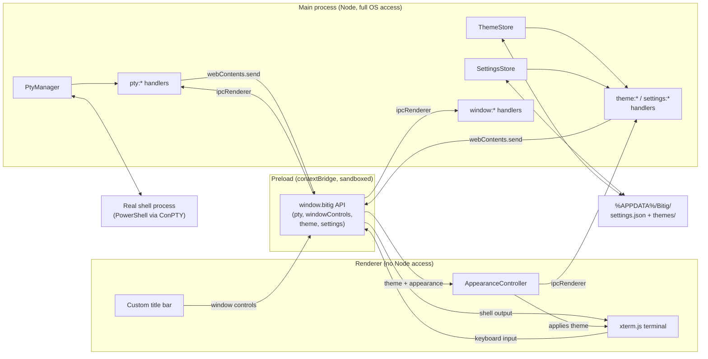
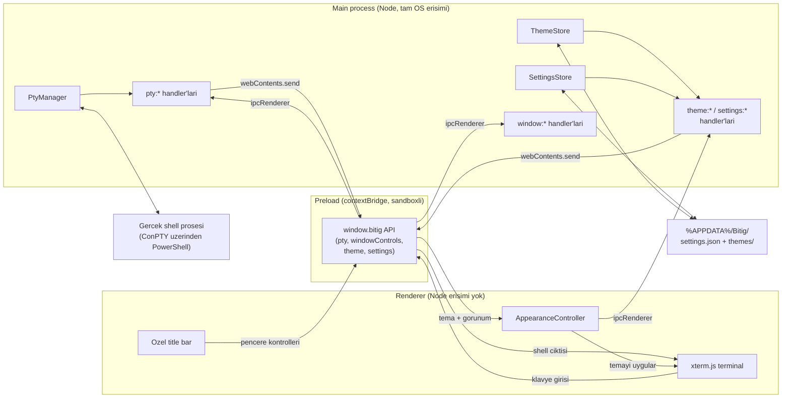

<div align="center">


# Bitig

**A terminal emulator for Windows, built from scratch.**
**Sifirdan yazilan, Windows icin bir terminal emulatoru.**

[](#)
[](#)
[](#)
[](#)
[](#)
[](#license--lisans)

**[English](#english)** &nbsp;|&nbsp; **[Turkce](#turkce)** &nbsp;|&nbsp; [Changelog](CHANGELOG.md)

</div>

---

<a id="english"></a>

# English

## Table of Contents

- [About](#about)
- [Features](#features)
- [Tech Stack](#tech-stack)
- [Architecture](#architecture)
- [IPC Channel Reference](#ipc-channel-reference)
- [Getting Started](#getting-started)
- [Keyboard Shortcuts](#keyboard-shortcuts)
- [Customization](#customization)
- [Project Structure](#project-structure)
- [Roadmap](#roadmap)
- [Contributing](#contributing)
- [Naming](#naming)

## About

Bitig is a desktop terminal emulator built for Windows 11, from the ground
up, as an alternative to Windows Terminal. It is not a fork or a theme on
top of an existing terminal; it is its own Electron application with its own
window chrome, its own rendering pipeline, and its own settings format.

The goal is a terminal that is visually customizable (themes, transparency,
custom title bar), fast to extend (a small, typed IPC surface between the
main and renderer processes), and eventually pluggable (a lightweight
extension system once the core is solid).

This project is under active, early development. It currently supports
multiple tabs, each of which can itself be split into multiple resizable
panes, each a real PowerShell process running behind a custom window,
rendered with xterm.js, themeable and optionally transparent with a
background image. A GUI settings panel is next - for now, everything is
driven by hand-editing a hot-reloaded `settings.json` plus a couple of
keyboard shortcuts (see [Customization](#customization)).

## Features

Shipped so far:

- Real Windows shell process (PowerShell) spawned through ConPTY via
  `node-pty`, with full keyboard input and live output streaming.
- xterm.js rendering with a hand-tuned color theme, block cursor bar, and
  scrollback buffer.
- Multiple independent tabs, each with its own shell process: open, close,
  switch, and drag to reorder, with Windows Terminal-style keyboard
  shortcuts (`Ctrl+Shift+T`, `Ctrl+Shift+W`, `Ctrl+Tab`).
- Split panes within a tab: divide horizontally or vertically
  (`Alt+Shift+D` / `Alt+Shift+E`), nest splits arbitrarily, drag the
  divider to resize, close a pane with `Ctrl+Shift+X`. Each pane is a real,
  independent shell process; every pane's size tracks its container via a
  `ResizeObserver`, so window resizing and divider dragging both keep every
  visible terminal correctly fitted with no extra wiring per interaction.
- A fully custom, frameless window: draggable title bar, minimize/maximize/
  close controls, rounded corners, and drop shadow, none of it borrowed from
  the OS chrome.
- A JSON-based theme system: four built-in themes (Bitig Dark, Bitig Light,
  a Dracula-style palette, a Nord-style palette) plus drop-in custom themes
  from `%APPDATA%/Bitig/themes/`, hot-reloaded, cycled with `Alt+Shift+T`.
- Transparency (real desktop showing through the window, not a simulated
  blur) and an optional full-window background image, both driven by
  `settings.json`.
- A typed, one-way-clear IPC contract between the Electron main process and
  the renderer, exposed through a narrow `contextBridge` API (no direct
  Node access from the UI).
- Strict TypeScript across main, preload, and renderer, with a shared type
  layer for IPC payloads.

Planned, in order:

- [x] Working minimal terminal (window, PTY, rendering, keyboard input)
- [x] Tabs (open, close, switch, drag-to-reorder)
- [x] Split panes (horizontal and vertical, resizable, drag divider)
- [x] Theme system (JSON based, built-in themes plus user themes)
- [x] Transparency and background image support
- [ ] Settings panel (GUI, no manual JSON editing required)
- [ ] Nerd Font detection and font picker
- [ ] Customizable keyboard shortcuts
- [ ] Command history and fuzzy search
- [ ] Lightweight plugin system (dynamic JS loading)
- [ ] Packaging (installer via `electron-builder`)

## Tech Stack

| Layer | Choice | Why |
|---|---|---|
| App shell | [Electron](https://www.electronjs.org/) | Mature desktop packaging, native OS integration on Windows |
| Build tooling | [electron-vite](https://electron-vite.org/) | Separate, sane build pipelines for main, preload, and renderer |
| Terminal rendering | [`@xterm/xterm`](https://xtermjs.org/) + fit, web-links, search addons | The de facto standard terminal renderer for web/Electron apps |
| Shell process management | [`node-pty`](https://github.com/microsoft/node-pty) | Real ConPTY-backed shell processes on Windows, N-API prebuilt binaries |
| Language | TypeScript (strict) | Type safety across process boundaries, catches IPC contract drift |
| Package manager | npm | Standard, no extra tooling required |

## Architecture

Three isolated processes, talking only through a narrow, typed IPC surface.
The renderer never touches Node or native modules directly.



Every tab owns a pane tree (`src/renderer/src/panes.ts`): a single leaf by
default, or a nested tree of splits once the user divides it. Every leaf
maps to exactly one `PtyManager` session and one `xterm.js` instance;
`TabStore` (`src/renderer/src/tabs.ts`) manages tabs and dispatches PTY
events to the correct leaf regardless of how deep it is nested.
`AppearanceController` (`src/renderer/src/appearance.ts`) is the one place
that resolves the active theme and appearance settings and applies them:
terminal colors to every open leaf, chrome colors as CSS custom
properties, and the background image layer.

## IPC Channel Reference

Naming convention: `<domain>:<action>`. Defined once in `src/shared/*.ts`
(`ptyTypes.ts`, `windowTypes.ts`, `themeTypes.ts`, `settingsTypes.ts`),
consumed by main, preload, and renderer alike, so the contract cannot
silently drift between processes.

| Channel | Direction | Kind | Purpose |
|---|---|---|---|
| `pty:create` | renderer to main | invoke | Start a new PTY session, returns its id |
| `pty:write` | renderer to main | send | Forward keyboard input to the shell |
| `pty:resize` | renderer to main | send | Resize the PTY when the terminal is resized |
| `pty:dispose` | renderer to main | send | Kill a PTY session (tab or pane closing) |
| `pty:data` | main to renderer | event | Shell output |
| `pty:exit` | main to renderer | event | Shell process exited |
| `window:minimize` | renderer to main | send | Minimize the window |
| `window:toggle-maximize` | renderer to main | send | Maximize or restore the window |
| `window:close` | renderer to main | send | Close the window |
| `window:is-maximized` | renderer to main | invoke | Query current maximize state |
| `window:maximize-change` | main to renderer | event | Notify the renderer when maximize state changes (OS-driven or otherwise) |
| `theme:list` | renderer to main | invoke | Return every built-in + user theme |
| `theme:list-changed` | main to renderer | event | A file in `themes/` was added, removed, or edited |
| `settings:get` | renderer to main | invoke | Return the current settings object |
| `settings:set` | renderer to main | send | Apply a partial update (deep-merged) |
| `settings:changed` | main to renderer | event | Broadcasts the full settings object after any change, from IPC or a hand-edit |
| `settings:read-background-image` | renderer to main | invoke | Read the configured background image file and return it as a `data:` URL |

## Getting Started

### Prerequisites

- Windows 11
- [Node.js](https://nodejs.org/) 20 or newer
- npm (bundled with Node.js)

### Install

```
git clone https://github.com/sametgurtuna/bitig.git
cd bitig
npm install
```

### Run in development

```
npm run dev
```

This builds the main and preload bundles, starts a Vite dev server for the
renderer, and launches the Electron window with hot reload.

### Build

```
npm run build
```

Produces production bundles under `out/`.

## Keyboard Shortcuts

There is no settings panel yet (see [Roadmap](#roadmap)), so these are the
only way to drive tabs, panes, and themes today. They are hardcoded for
now; milestone 8 makes them remappable.

| Shortcut | Action |
|---|---|
| `Ctrl+Shift+T` | New tab |
| `Ctrl+Shift+W` | Close the active tab |
| `Ctrl+Tab` / `Ctrl+Shift+Tab` | Next / previous tab |
| Middle-click a tab | Close that tab |
| Drag a tab | Reorder tabs |
| `Alt+Shift+D` | Split the focused pane, new pane to the right |
| `Alt+Shift+E` | Split the focused pane, new pane below |
| `Ctrl+Shift+X` | Close the focused pane (closes the tab if it was the last pane) |
| Click a pane | Focus it |
| Drag a pane divider | Resize the two panes on either side |
| `Alt+Shift+T` | Cycle to the next available theme |

## Customization

No GUI yet - both of the following are read live from disk with no
restart required, which in practice covers most of what a settings panel
would otherwise be for.

### Settings

`%APPDATA%/Bitig/settings.json` is created automatically on first launch.
Edit it in any text editor and save; the running app picks up the change
within a fraction of a second (`fs.watch`-based, debounced so a
still-being-saved file is never read half-written).

```jsonc
{
  "schemaVersion": 1,
  "activeTheme": "nord",
  "appearance": {
    "opacity": 0.92,
    "backgroundImage": "C:\\Users\\you\\Pictures\\bg.png",
    "backgroundImageOpacity": 0.25,
    "backgroundImageFit": "cover"
  }
}
```

- `activeTheme` - the `id` of a built-in or custom theme (see below).
- `appearance.opacity` - `0.3`-`1`, clamped on write so the window can
  never become fully invisible or unclickable by a typo.
- `appearance.backgroundImage` - an absolute path to an image, or `null`.
  There is no in-app file picker yet (that needs a settings panel to host
  a "Browse..." button) - point it at a file by hand.
- `appearance.backgroundImageFit` - `"cover"`, `"contain"`, `"center"`, or
  `"tile"`.

### Themes

Four themes ship built in: `bitig-dark` (default), `bitig-light`,
`dracula`, `nord`. Cycle through them with `Alt+Shift+T`, or set
`activeTheme` to a specific `id` directly.

Drop a custom theme JSON file into `%APPDATA%/Bitig/themes/` and it
becomes available immediately, no restart - editing an already-selected
theme file updates the running terminal's colors live, too.

```jsonc
{
  "schemaVersion": 1,
  "id": "my-custom-theme",
  "name": "My Custom Theme",
  "author": "you",
  "terminal": {
    "background": "#0f1117",
    "foreground": "#d8dee9",
    "cursor": "#7dd3fc",
    "cursorAccent": "#0f1117",
    "selectionBackground": "#2d3444",
    "black": "#1a1c23",
    "red": "#f47067",
    "green": "#7ee787",
    "yellow": "#e3b341",
    "blue": "#79c0ff",
    "magenta": "#d2a8ff",
    "cyan": "#56d4dd",
    "white": "#d0d7de",
    "brightBlack": "#4b5263",
    "brightRed": "#ff9492",
    "brightGreen": "#a5f3b8",
    "brightYellow": "#f2cc60",
    "brightBlue": "#a5d6ff",
    "brightMagenta": "#e2c5ff",
    "brightCyan": "#8ce4ec",
    "brightWhite": "#ffffff"
  },
  "ui": {
    "background": "#0f1117",
    "titlebarBackground": "#14161e",
    "titlebarText": "#8b93a7",
    "border": "#22252f",
    "accent": "#7dd3fc"
  }
}
```

`terminal` maps directly onto xterm.js's own theme fields (all 16 ANSI
colors plus background/foreground/cursor/selection); `ui` covers the
title bar and window chrome. A file missing required fields or with an
invalid `schemaVersion` is skipped with a logged error rather than
crashing the app or silently corrupting the theme list - check the
terminal running `npm run dev` if a theme you dropped in doesn't show up.

## Project Structure

```
Bitig/
  electron.vite.config.ts   # Build config for main/preload/renderer
  tsconfig.json              # Renderer TypeScript config (strict)
  tsconfig.node.json         # Main + preload TypeScript config (strict)
  src/
    shared/
      ptyTypes.ts             # PTY IPC contract, shared across processes
      windowTypes.ts          # Window control IPC contract
      themeTypes.ts           # BitigTheme schema + theme:* IPC contract
      settingsTypes.ts        # BitigSettings schema + settings:* IPC contract
      builtinThemes/          # bitigDark/bitigLight/dracula/nord.ts + index (BUILTIN_THEMES)
    main/
      index.ts                # App lifecycle, BrowserWindow creation
      pty/ptyManager.ts       # PTY session lifecycle (create/write/resize/dispose)
      theme/themeStore.ts     # Merges built-in + user themes, watches themes/
      settings/settingsStore.ts # Loads/merges/watches settings.json, clamps opacity
      ipc/ptyHandlers.ts      # pty:* channel handlers
      ipc/windowHandlers.ts   # window:* channel handlers
      ipc/themeHandlers.ts    # theme:* channel handlers
      ipc/settingsHandlers.ts # settings:* channel handlers
    preload/
      index.ts                # contextBridge surface: window.bitig
    renderer/
      index.html
      src/
        main.ts                # Thin bootstrap: title bar + AppearanceController + TabStore
        tabs.ts                 # TabStore: tab lifecycle, tab bar, drag-to-reorder, shortcuts
        panes.ts                # Pane tree: split/close/render, divider drag, per-leaf ResizeObserver
        appearance.ts           # Applies active theme/opacity/background image, theme-cycle shortcut
        titlebar.ts             # Custom title bar behavior
        style.css
```

## Roadmap

See the [Features](#features) checklist above for the short version. A
detailed, milestone-by-milestone plan, including design notes, sub-tasks,
and acceptance criteria for every upcoming feature, lives in
[`ROADMAP.md`](ROADMAP.md). Progress and notable changes are tracked in
[`CHANGELOG.md`](CHANGELOG.md).

## Contributing

This project is in an early, fast-moving stage; the architecture may still
shift as the settings panel and further milestones land. If you want to
experiment locally, fork the repo, keep changes to one concern per commit,
and write commit messages in English, following the existing style.

## Naming

"Bitig" is an Old Turkic word meaning "writing" or "written text". The name
follows the same naming tradition as the author's other projects, which draw
on Turkic mythology and Old Turkic vocabulary.

<div align="right">

[Back to top](#bitig)

</div>

---

<a id="turkce"></a>

# Turkce

## Icindekiler

- [Proje Hakkinda](#proje-hakkinda)
- [Ozellikler](#ozellikler)
- [Teknik Yigin](#teknik-yigin)
- [Mimari](#mimari)
- [IPC Kanal Referansi](#ipc-kanal-referansi)
- [Baslarken](#baslarken)
- [Klavye Kisayollari](#klavye-kisayollari)
- [Ozellestirme](#ozellestirme)
- [Proje Yapisi](#proje-yapisi)
- [Yol Haritasi](#yol-haritasi)
- [Katkida Bulunma](#katkida-bulunma)
- [Isim Hakkinda](#isim-hakkinda)

## Proje Hakkinda

Bitig, Windows 11 icin sifirdan yazilan, Windows Terminal'e alternatif bir
masaustu terminal emulatoru. Var olan bir terminale eklenen bir tema ya da
fork degil; kendi pencere govdesi, kendi render hattı ve kendi ayar
formatiyla bagimsiz bir Electron uygulamasi.

Hedef: gorsel olarak ozellestirilebilir (temalar, seffaflik, ozel title bar),
genisletmesi kolay (main ve renderer surecleri arasinda kucuk ve tipli bir
IPC yuzeyi) ve zamanla eklenti destekli (cekirdek saglamlastiktan sonra
hafif bir eklenti sistemi) bir terminal.

Proje aktif ve erken gelistirme asamasinda. Su an birden fazla sekmeyi
destekliyor; her sekme kendi icinde birden fazla boyutlandirilabilir
pane'e bolunebiliyor, her pane ozel bir pencerenin arkasinda calisan
gercek bir PowerShell prosesi, xterm.js ile render ediliyor, temalanabilir
ve istege bagli olarak arkaplan gorseliyle seffaf olabiliyor. Sirada GUI
ayarlar paneli var - simdilik her sey elle duzenlenen, hot-reload'lu bir
`settings.json` ve birkac klavye kisayoluyla yonetiliyor (bkz.
[Ozellestirme](#ozellestirme)).

## Ozellikler

Su ana kadar tamamlananlar:

- `node-pty` uzerinden ConPTY ile baslatilan gercek bir Windows shell
  prosesi (PowerShell); tam klavye girisi ve canli cikti akisi.
- Elle ayarlanmis renk temasi, blok imlec ve scrollback tamponuyla xterm.js
  render motoru.
- Her biri kendi shell prosesine sahip, birbirinden bagimsiz sekmeler: ac,
  kapat, gecis yap, surukleyerek sirala; Windows Terminal tarzi klavye
  kisayollari (`Ctrl+Shift+T`, `Ctrl+Shift+W`, `Ctrl+Tab`).
- Sekme icinde split pane: yatay ya da dikey bolme (`Alt+Shift+D` /
  `Alt+Shift+E`), istenilen derinlikte ic ice bolme, divider'i suruklerek
  yeniden boyutlandirma, `Ctrl+Shift+X` ile pane kapatma. Her pane gercek,
  bagimsiz bir shell prosesi; her pane'in boyutu bir `ResizeObserver` ile
  kendi container'ini takip ediyor, bu yuzden hem pencere boyutlandirma
  hem de divider surukleme, her etkilesim icin ayri kod yazmadan tum
  gorunur terminalleri dogru olcude tutuyor.
- Tamamen ozel, cercevesiz (frameless) bir pencere: suruklenebilir title
  bar, minimize/maximize/close kontrolleri, yuvarlak koseler ve golge - hicbiri
  OS'nin varsayilan pencere govdesinden gelmiyor.
- JSON tabanli tema sistemi: dort hazir tema (Bitig Dark, Bitig Light,
  Dracula-stili, Nord-stili) artı `%APPDATA%/Bitig/themes/` altina birakilan
  ozel temalar, hot-reload'lu, `Alt+Shift+T` ile dongusel gecis.
  Seffaflik (simule edilmis bir bulaniklik degil, pencerenin arkasindaki
  gercek masaustunun gorunmesi) ve istege bagli tam pencere arkaplan
  gorseli, ikisi de `settings.json` uzerinden yonetiliyor.
- Electron main sureci ile renderer arasinda tipli, tek yonu net bir IPC
  sozlesmesi; dar bir `contextBridge` API'siyle disari aciliyor (UI'dan
  dogrudan Node erisimi yok).
- Main, preload ve renderer'da strict TypeScript, IPC payload'lari icin
  paylasilan bir tip katmaniyla.

Sirasiyla planlananlar:

- [x] Calisan minimal terminal (pencere, PTY, render, klavye girisi)
- [x] Sekmeler (ac, kapat, gecis yap, surukle-sirala)
- [x] Split pane (yatay ve dikey bolme, boyutlandirilabilir divider)
- [x] Tema sistemi (JSON tabanli, hazir temalar + kullanici temalari)
- [x] Seffaflik ve arkaplan gorseli destegi
- [ ] Ayarlar paneli (GUI, elle JSON duzenlemeye gerek kalmadan)
- [ ] Nerd Font tespiti ve font secici
- [ ] Ozellestirilebilir klavye kisayollari
- [ ] Komut gecmisi ve fuzzy arama
- [ ] Hafif eklenti sistemi (dinamik JS yukleme)
- [ ] Paketleme (`electron-builder` ile installer)

## Teknik Yigin

| Katman | Secim | Neden |
|---|---|---|
| Uygulama kabugu | [Electron](https://www.electronjs.org/) | Olgun masaustu paketleme, Windows'ta native entegrasyon |
| Build araci | [electron-vite](https://electron-vite.org/) | Main/preload/renderer icin ayri, duzenli build hatlari |
| Terminal render | [`@xterm/xterm`](https://xtermjs.org/) + fit, web-links, search eklentileri | Web/Electron uygulamalari icin fiili standart terminal render motoru |
| Shell proses yonetimi | [`node-pty`](https://github.com/microsoft/node-pty) | Windows'ta gercek ConPTY tabanli shell prosesleri, N-API hazir derlemeleriyle |
| Dil | TypeScript (strict) | Proses sinirlari arasinda tip guvenligi, IPC sozlesmesindeki sapmayi yakalar |
| Paket yoneticisi | npm | Standart, ekstra arac gerektirmiyor |

## Mimari

Uc izole proses, sadece dar ve tipli bir IPC yuzeyi uzerinden konusuyor.
Renderer hicbir zaman Node ya da native modullere dogrudan dokunmuyor.



Her sekme bir pane agacina sahiptir (`src/renderer/src/panes.ts`):
varsayilan olarak tek bir leaf, kullanici boldukce ic ice gecmis bir split
agaci. Her leaf tam olarak bir `PtyManager` oturumuna ve bir `xterm.js`
instance'ina karsilik gelir; `TabStore` (`src/renderer/src/tabs.ts`)
sekmeleri yonetir ve PTY olaylarini, ne kadar derinde olursa olsun dogru
leaf'e yonlendirir. `AppearanceController`
(`src/renderer/src/appearance.ts`), aktif temayi ve gorunum ayarlarini
cozumleyip uygulayan tek yer: terminal renklerini acik her leaf'e, chrome
renklerini CSS custom property olarak, ve arkaplan gorseli katmanini.

## IPC Kanal Referansi

Isimlendirme kurali: `<alan>:<eylem>`. `src/shared/*.ts` icinde
(`ptyTypes.ts`, `windowTypes.ts`, `themeTypes.ts`, `settingsTypes.ts`) bir
kere tanimlanir, main/preload/renderer tarafindan ortak kullanilir - bu
sayede sozlesme surecler arasinda sessizce kaymaz.

| Kanal | Yon | Tip | Amac |
|---|---|---|---|
| `pty:create` | renderer -> main | invoke | Yeni bir PTY oturumu baslatir, id doner |
| `pty:write` | renderer -> main | send | Klavye girisini shell'e iletir |
| `pty:resize` | renderer -> main | send | Terminal boyut degistiginde PTY'yi yeniden boyutlandirir |
| `pty:dispose` | renderer -> main | send | Bir PTY oturumunu sonlandirir (sekme/pane kapaninca) |
| `pty:data` | main -> renderer | event | Shell ciktisi |
| `pty:exit` | main -> renderer | event | Shell prosesi sonlandi |
| `window:minimize` | renderer -> main | send | Pencereyi kucultur |
| `window:toggle-maximize` | renderer -> main | send | Pencereyi buyutur ya da geri yukler |
| `window:close` | renderer -> main | send | Pencereyi kapatir |
| `window:is-maximized` | renderer -> main | invoke | Mevcut maximize durumunu sorgular |
| `window:maximize-change` | main -> renderer | event | Maximize durumu degistiginde renderer'i bilgilendirir (OS kaynakli dahil) |
| `theme:list` | renderer -> main | invoke | Tum hazir + kullanici temalarini doner |
| `theme:list-changed` | main -> renderer | event | `themes/` klasorunde bir dosya eklendi/silindi/degisti |
| `settings:get` | renderer -> main | invoke | Guncel ayarlar objesini doner |
| `settings:set` | renderer -> main | send | Kismi bir guncelleme uygular (derinlemesine birlestirilir) |
| `settings:changed` | main -> renderer | event | Herhangi bir yoldan (IPC ya da elle duzenleme) degisince tam ayarlar objesini yayinlar |
| `settings:read-background-image` | renderer -> main | invoke | Ayarlanan arkaplan gorseli dosyasini okuyup `data:` URL olarak doner |

## Baslarken

### On kosullar

- Windows 11
- [Node.js](https://nodejs.org/) 20 ya da uzeri
- npm (Node.js ile birlikte gelir)

### Kurulum

```
git clone https://github.com/sametgurtuna/bitig.git
cd bitig
npm install
```

### Gelistirme modunda calistirma

```
npm run dev
```

Bu komut main ve preload paketlerini derler, renderer icin bir Vite dev
server baslatir ve hot reload aktif sekilde Electron penceresini acar.

### Build alma

```
npm run build
```

Prodüksiyon paketlerini `out/` altinda uretir.

## Klavye Kisayollari

Henuz bir ayarlar paneli yok (bkz. [Yol Haritasi](#yol-haritasi)), bu
yuzden sekmeleri, pane'leri ve temalari yonetmenin tek yolu bunlar. Simdilik
sabit; milestone 8 bunlari yeniden atanabilir hale getirecek.

| Kisayol | Eylem |
|---|---|
| `Ctrl+Shift+T` | Yeni sekme |
| `Ctrl+Shift+W` | Aktif sekmeyi kapat |
| `Ctrl+Tab` / `Ctrl+Shift+Tab` | Sonraki / onceki sekme |
| Sekmeye orta tikla | O sekmeyi kapat |
| Sekmeyi surukle | Sekmeleri yeniden sirala |
| `Alt+Shift+D` | Odakli pane'i bol, yeni pane saga |
| `Alt+Shift+E` | Odakli pane'i bol, yeni pane asagiya |
| `Ctrl+Shift+X` | Odakli pane'i kapat (son pane ise sekme de kapanir) |
| Pane'e tikla | Odaklan |
| Divider'i surukle | Iki yanindaki pane'leri yeniden boyutlandir |
| `Alt+Shift+T` | Sonraki mevcut temaya gec |

## Ozellestirme

Henuz GUI yok - asagidakilerin ikisi de restart gerekmeden, diskten canli
okunur; pratikte bir ayarlar panelinin karsilayacagi cogu ihtiyaci zaten
karsilar.

### Ayarlar

`%APPDATA%/Bitig/settings.json` ilk acilista otomatik olusturulur. Herhangi
bir metin editorunde duzenleyip kaydet; calisan uygulama degisikligi saniye
altinda yakalar (`fs.watch` tabanli, yarim yazilmis bir dosyayi asla
okumamak icin debounce'lu).

```jsonc
{
  "schemaVersion": 1,
  "activeTheme": "nord",
  "appearance": {
    "opacity": 0.92,
    "backgroundImage": "C:\\Users\\sen\\Pictures\\arkaplan.png",
    "backgroundImageOpacity": 0.25,
    "backgroundImageFit": "cover"
  }
}
```

- `activeTheme` - hazir ya da ozel bir temanin `id`'si (asagiya bak).
- `appearance.opacity` - `0.3`-`1` arasi, yazilirken kelepceleniyor ki bir
  yazim hatasi pencereyi tamamen gorunmez/tiklanamaz hale getiremesin.
- `appearance.backgroundImage` - bir gorselin mutlak yolu, ya da `null`.
  Henuz uygulama icinde dosya secici yok (bunun icin "Browse..." butonu
  barindiracak bir ayarlar paneli gerekir) - yolu elle yaz.
- `appearance.backgroundImageFit` - `"cover"`, `"contain"`, `"center"` ya
  da `"tile"`.

### Temalar

Dort hazir tema geliyor: `bitig-dark` (varsayilan), `bitig-light`,
`dracula`, `nord`. `Alt+Shift+T` ile aralarinda dolas, ya da `activeTheme`'i
dogrudan bir `id`'ye ayarla.

`%APPDATA%/Bitig/themes/` klasorune ozel bir tema JSON dosyasi birak, hemen
kullanilabilir olur, restart gerekmez - zaten secili bir tema dosyasini
duzenlemek de calisan terminalin renklerini canli gunceller.

```jsonc
{
  "schemaVersion": 1,
  "id": "benim-temam",
  "name": "Benim Temam",
  "author": "sen",
  "terminal": {
    "background": "#0f1117",
    "foreground": "#d8dee9",
    "cursor": "#7dd3fc",
    "cursorAccent": "#0f1117",
    "selectionBackground": "#2d3444",
    "black": "#1a1c23",
    "red": "#f47067",
    "green": "#7ee787",
    "yellow": "#e3b341",
    "blue": "#79c0ff",
    "magenta": "#d2a8ff",
    "cyan": "#56d4dd",
    "white": "#d0d7de",
    "brightBlack": "#4b5263",
    "brightRed": "#ff9492",
    "brightGreen": "#a5f3b8",
    "brightYellow": "#f2cc60",
    "brightBlue": "#a5d6ff",
    "brightMagenta": "#e2c5ff",
    "brightCyan": "#8ce4ec",
    "brightWhite": "#ffffff"
  },
  "ui": {
    "background": "#0f1117",
    "titlebarBackground": "#14161e",
    "titlebarText": "#8b93a7",
    "border": "#22252f",
    "accent": "#7dd3fc"
  }
}
```

`terminal`, xterm.js'in kendi tema alanlarina (16 ANSI rengi artı
background/foreground/cursor/selection) birebir karsilik gelir; `ui` title
bar ve pencere govdesini kapsar. Gerekli alanlari eksik ya da
`schemaVersion`'i gecersiz bir dosya, uygulamayi cokertmeden ya da tema
listesini sessizce bozmadan, loglanmis bir hatayla atlanir - biraktigin
bir tema gorunmuyorsa `npm run dev` calisan terminale bak.

## Proje Yapisi

```
Bitig/
  electron.vite.config.ts   # main/preload/renderer icin build config'i
  tsconfig.json              # Renderer TypeScript config'i (strict)
  tsconfig.node.json         # Main + preload TypeScript config'i (strict)
  src/
    shared/
      ptyTypes.ts             # PTY IPC sozlesmesi, surecler arasi paylasilir
      windowTypes.ts          # Pencere kontrol IPC sozlesmesi
      themeTypes.ts           # BitigTheme semasi + theme:* IPC sozlesmesi
      settingsTypes.ts        # BitigSettings semasi + settings:* IPC sozlesmesi
      builtinThemes/          # bitigDark/bitigLight/dracula/nord.ts + index (BUILTIN_THEMES)
    main/
      index.ts                # App lifecycle, BrowserWindow olusturma
      pty/ptyManager.ts       # PTY oturum yasam dongusu (create/write/resize/dispose)
      theme/themeStore.ts     # Hazir + kullanici temalarini birlestirir, themes/'i izler
      settings/settingsStore.ts # settings.json'u yukler/birlestirir/izler, opakligi kelepceler
      ipc/ptyHandlers.ts      # pty:* kanal handler'lari
      ipc/windowHandlers.ts   # window:* kanal handler'lari
      ipc/themeHandlers.ts    # theme:* kanal handler'lari
      ipc/settingsHandlers.ts # settings:* kanal handler'lari
    preload/
      index.ts                # contextBridge yuzeyi: window.bitig
    renderer/
      index.html
      src/
        main.ts                # Ince bootstrap: title bar + AppearanceController + TabStore
        tabs.ts                 # TabStore: sekme yasam dongusu, tab bar, surukle-sirala, kisayollar
        panes.ts                # Pane agaci: split/close/render, divider surukleme, leaf basina ResizeObserver
        appearance.ts           # Aktif tema/opaklik/arkaplan gorselini uygular, tema dongusu kisayolu
        titlebar.ts             # Ozel title bar davranisi
        style.css
```

## Yol Haritasi

Kisa liste icin yukaridaki [Ozellikler](#ozellikler) bolumune bak. Her
milestone icin tasarim notlari, alt gorevler ve kabul kriterleri iceren
detayli plan (Ingilizce) [`ROADMAP.md`](ROADMAP.md) dosyasinda. Ilerleme ve
onemli degisiklikler [`CHANGELOG.md`](CHANGELOG.md) dosyasinda takip
ediliyor.

## Katkida Bulunma

Proje erken ve hizli degisen bir asamada; ayarlar paneli ve sonraki
milestone'lar eklendikce mimari daha da degisebilir. Lokal olarak denemek
istersen reposu fork'la, her commit'i tek bir konuya odakla ve commit
mesajlarini mevcut stile uygun sekilde Ingilizce yaz.

## Isim Hakkinda

"Bitig", Eski Turkce'de "yazi" ya da "yazili metin" anlamina gelir. Isim,
yazarin diger projelerinde de takip ettigi, Turk mitolojisi ve Eski Turkce
kelime dagarcigina dayanan isimlendirme gelenegini surdurur.

<div align="right">

[Basa don / Back to top](#bitig)

</div>

---

<div align="center" id="license--lisans">

**License / Lisans:** [ISC](package.json)

</div>
