<div align="center">


<h1>Bitig</h1>

<p><b>A terminal emulator for Windows, built from scratch.</b></p>

[](CHANGELOG.md)
[](#installation)
[](https://www.electronjs.org/)
[](tsconfig.json)
[](#license)

<p>
<a href="#installation"><b>Install</b></a>
&nbsp;·&nbsp;
<a href="#feature-tour"><b>Feature tour</b></a>
&nbsp;·&nbsp;
<a href="#architecture"><b>Architecture</b></a>
&nbsp;·&nbsp;
<a href="CHANGELOG.md">Changelog</a>
&nbsp;·&nbsp;
<a href="ROADMAP.md">Roadmap</a>
&nbsp;·&nbsp;
<a href="FEATURES.md">Features</a>
</p>

</div>

---

<div align="center">

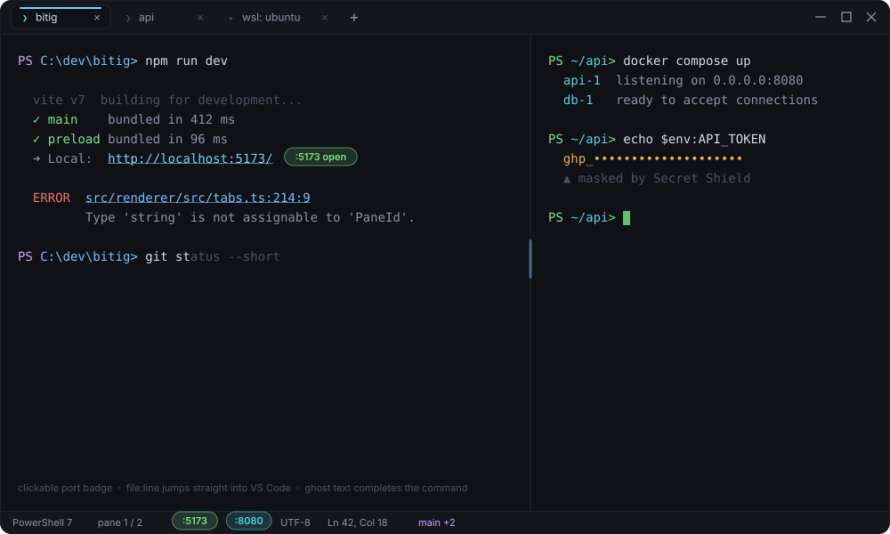

<sub>Tabs in the title bar · nested split panes · clickable port badges · <code>file:line</code> smart links · masked secrets · live status bar</sub>

</div>

---

## Contents

| | |
|---|---|
| [About](#about) | What Bitig is and is not |
| [Installation](#installation) | Setup installer, portable build and package managers |
| [Feature tour](#feature-tour) | Every capability, one screen at a time |
| [Keyboard shortcuts](#keyboard-shortcuts) | Default bindings |
| [Customization](#customization) | Settings, themes, snippets, plugins |
| [Architecture](#architecture) | Process boundaries and data flow |
| [IPC channel reference](#ipc-channel-reference) | The full typed contract |
| [Tech stack](#tech-stack) | Layers and why each was chosen |
| [Building from source](#building-from-source) | Dev and release builds |
| [Project structure](#project-structure) | Where everything lives |
| [Contributing](#contributing) | Working on the project |

---

## About

Bitig is a desktop terminal emulator written from the ground up for Windows 11
as an alternative to Windows Terminal. It is not a fork, a theme, or a shell on
top of an existing terminal. It is its own Electron application with its own
window chrome, its own rendering pipeline, its own settings format, and its own
plugin runtime.

The goal is a **Developer Cockpit**: a terminal that stops being a passive text
stream and becomes an interactive workstation. Clickable port badges, smart file
hyperlinks, automatic secret masking, parametric runbooks, frecency ranked
command history, a sandboxed plugin system, and a Quake style HUD mode.

Everything runs locally. Zero cloud dependency, zero telemetry, no account. All
state lives in plain JSON under `%APPDATA%/Bitig/`.

> **About the images in this README.** Every picture below is a vector preview
> generated by [`scripts/make-readme-assets.mjs`](scripts/make-readme-assets.mjs)
> from the app's real theme values and layout metrics, so it stays in sync with
> the code and renders identically for everyone. Run the script to regenerate
> them.

---

## Installation

<table>
<tr>
<td width="50%" valign="top">

**Package managers**

```powershell
winget install Bitig.Bitig
```

```powershell
scoop bucket add bitig https://github.com/sametgurtuna/scoop-bitig
scoop install bitig
```

```powershell
choco install bitig
```

Winget and Chocolatey install the NSIS build; Scoop installs the portable build
and puts `bitig` on your `PATH`.

</td>
<td width="50%" valign="top">

**Direct download**

The latest release for Windows 11 x64 is on the
[Releases page](https://github.com/sametgurtuna/bitig/releases/latest).

| Build | File |
|---|---|
| **Setup** | `Bitig-Setup-1.0.4.exe` |
| **Portable** | `Bitig-Portable-1.0.4.exe` |

The installer lets you pick a directory and creates Start Menu and desktop
shortcuts. The portable build is a single self contained executable that writes
nothing to the registry.

Both builds are x64 only and require Windows 11. No prerequisites: Node.js,
Electron and the native ConPTY bindings are bundled.

</td>
</tr>
</table>

**Updating and removing**

```powershell
winget upgrade Bitig.Bitig     # winget uninstall Bitig.Bitig
scoop update bitig             # scoop uninstall bitig
choco upgrade bitig            # choco uninstall bitig
```

Settings, themes, snippets and history live in `%APPDATA%/Bitig/` and survive an
uninstall. Delete that folder for a clean slate.

---

## Feature tour

### Inline suggestions

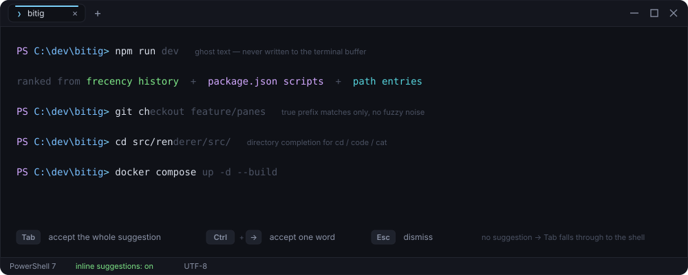

Fish style ghost text as you type. Only **true prefix matches** are ever
suggested, ranked by frecency (recency, run count, same working directory, and a
penalty for commands that failed), then by project context: `package.json`
scripts across `npm`/`pnpm`/`yarn`/`bun`, `Makefile` targets, and directory or
file names for the argument of path commands (`cd`, `code`, `cat`, `rm` and
friends).

The suggestion is drawn as an absolutely positioned DOM overlay and is **never**
written into the terminal buffer, so it cannot race with the shell's own echo.

| Key | Behaviour |
|---|---|
| `Tab` | Accept the whole suggestion |
| `Ctrl`/`Alt`+`→` | Accept one word at a time |
| `Esc` | Dismiss |
| `Tab` (no suggestion) | Falls through to the shell's own completion, untouched |

### Split panes and tabs

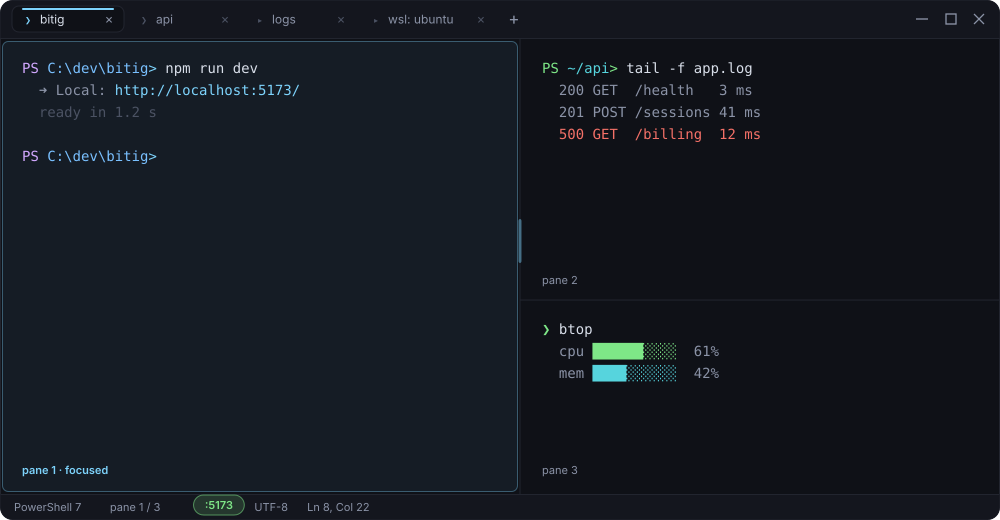

Every tab owns a pane tree, so splits nest arbitrarily and each leaf is its own
PTY session. The divider is draggable, any pane can be zoomed to the full tab
area, and closing a pane with a live session asks first.

Tabs drag to reorder, middle click to close, double click to rename, and
**retitle themselves to the current working directory** as you `cd` — driven by
an OSC 7 prompt hook that Bitig injects into PowerShell, CMD and bash, not by
the unreliable OSC 0/2 title stream.

`Ctrl+Shift+N` opens a fully independent window with its own tabs and shell
processes; closing the last one exits the process completely, with no ghost
background instance left behind.

### Universal command palette

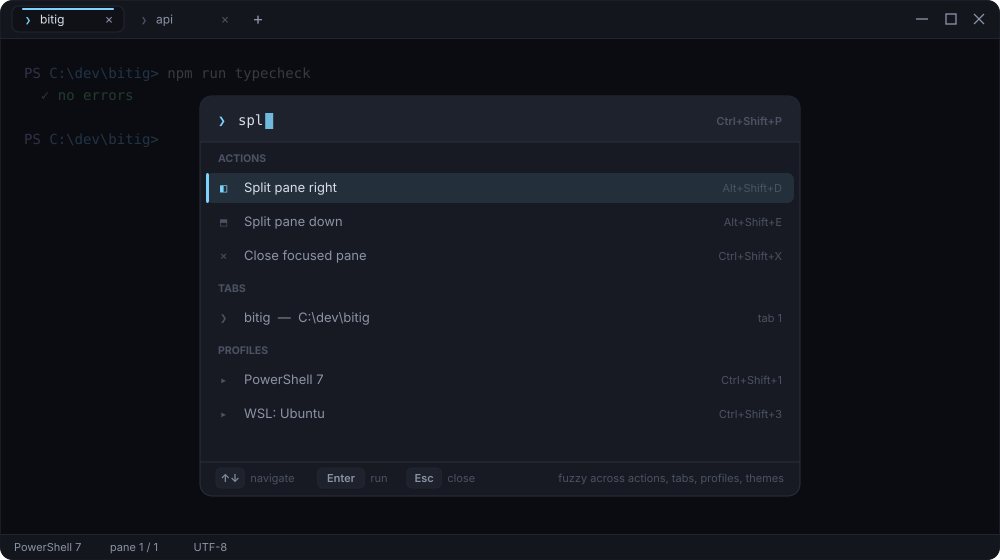

`Ctrl+Shift+P` fuzzy searches **actions, open tabs, shell profiles and themes**
in one list. Every entry shows its current shortcut, and because actions come
from the same central registry the keyboard settings use, plugin contributed
actions appear here too.

### Command history

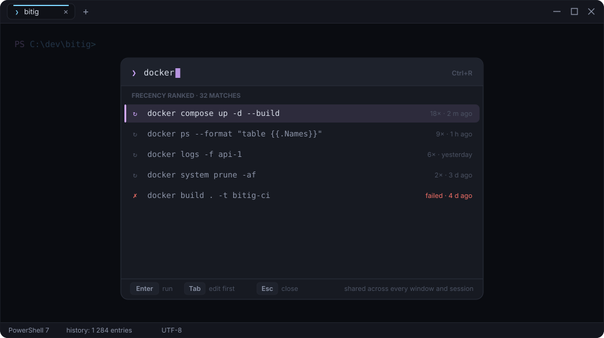

`Ctrl+R` opens Bitig's own history modal instead of relying on the shell's.
Entries are shared across every window and session, ranked by frecency, and
annotated with run count, age and whether the command failed. Secrets are masked
before anything is persisted.

### Bitig Betik — parametric runbooks

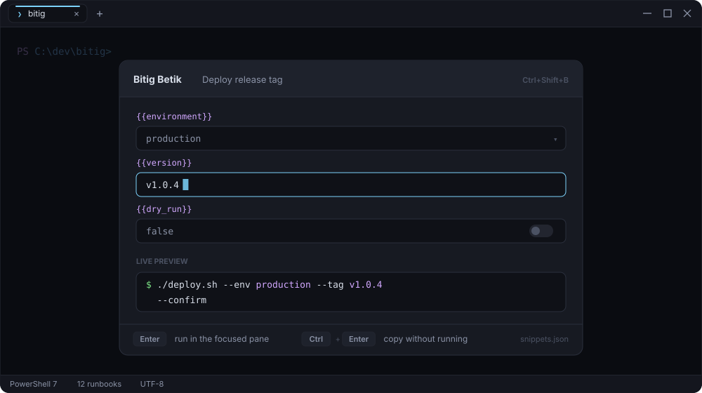

Turn a command you keep re-typing into a form. Put `{{variable}}` placeholders in
a snippet template and `Ctrl+Shift+B` renders them as typed fields with a live
preview of the exact command. Run it in the focused pane, or copy it without
running. Built in runbooks ship with the app; your own live in
`%APPDATA%/Bitig/snippets.json`.

### In terminal search

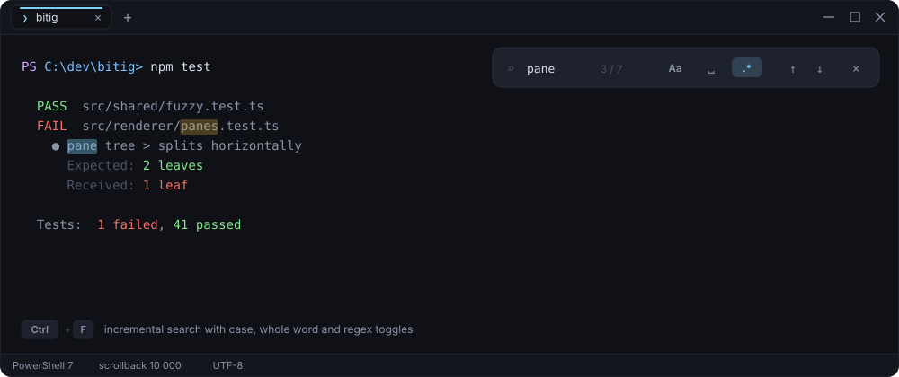

`Ctrl+F` searches the scrollback incrementally, with case sensitivity, whole word
and regular expression toggles, a match counter, and highlighted hits in the
buffer.

### Developer Cockpit

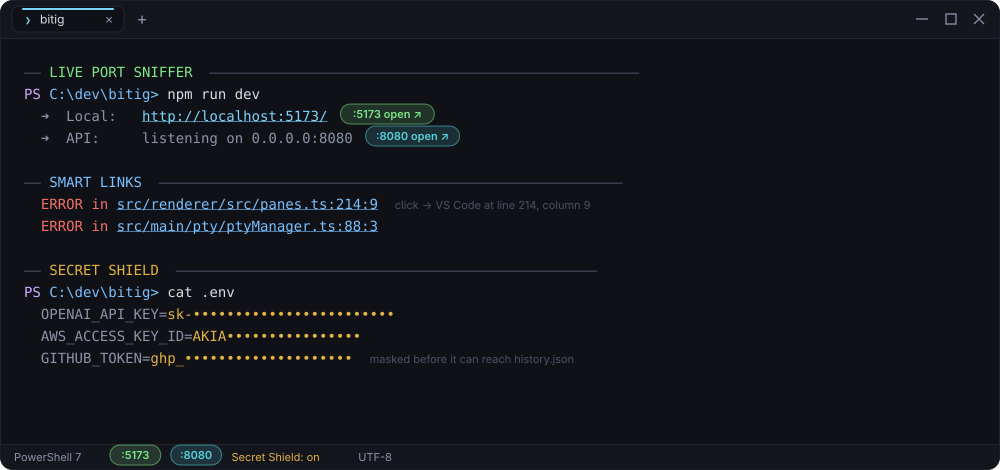

Three features that read the PTY stream and turn plain text into something you
can act on:

| | |
|---|---|
| **Live Port Sniffer** | Detects dev servers as they announce themselves and renders a clickable badge in the terminal and the status bar. Click it to open `localhost:PORT`. |
| **Smart Links** | Turns `src/main.ts:42:15` into a one click jump into VS Code or Cursor, at the exact line and column. |
| **Secret Shield** | Masks tokens (`sk-`, `ghp_`, `AKIA`, bearer tokens, private keys) **before** anything reaches the history store. |

### Bitig Bilge — the AI companion

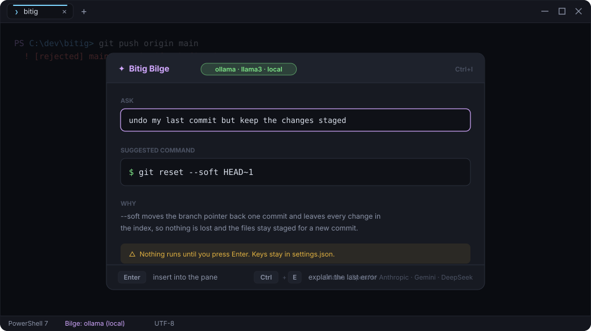

`Ctrl+I` turns a sentence into a command, and explains the error you just hit.
It runs fully local against **Ollama**, or bring your own key for OpenAI,
Anthropic, Gemini, DeepSeek and any OpenAI compatible endpoint. Nothing executes
until you press Enter, and keys never leave `settings.json`.

### Power modes

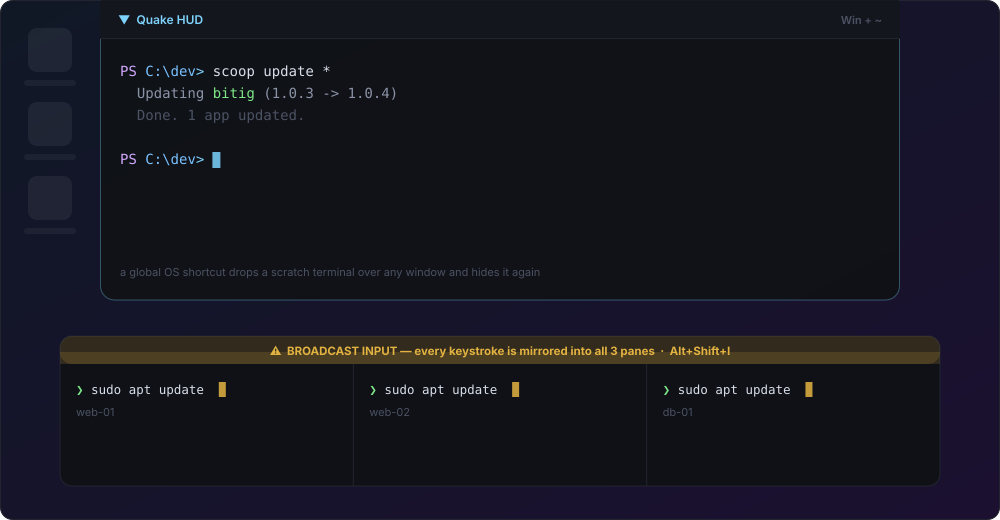

**Quake HUD** binds a global OS shortcut to a dropdown terminal that slides over
whatever you are doing and hides again. The HUD window is created lazily on first
use, so it never keeps the app alive in the background.

**Broadcast Input** (`Alt+Shift+I`) mirrors every keystroke into all panes of the
active tab, with an unmistakable synchronization banner so you always know it is
on.

### Themes

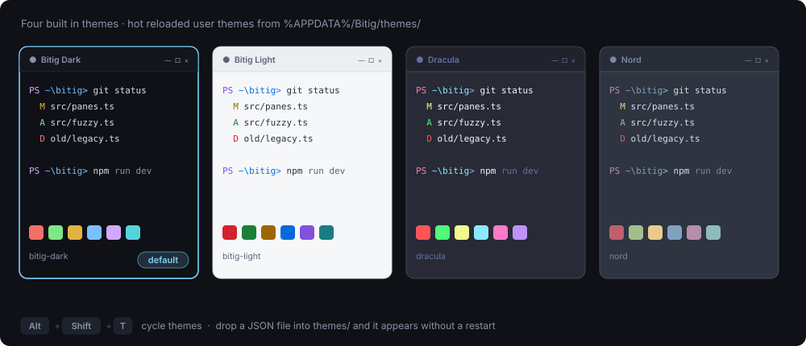

Four themes ship built in — `bitig-dark` (default), `bitig-light`, `dracula`,
`nord`. Drop a JSON file into `%APPDATA%/Bitig/themes/` and it appears
immediately, no restart. `Alt+Shift+T` cycles through them. A theme file mirrors
the xterm.js theme fields (all 16 ANSI colors plus background, foreground, cursor
and selection) plus a `ui` block for the window chrome.

### Transparency and background images

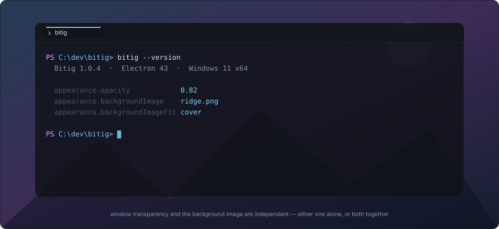

Window transparency and the background image are independent settings, like in
Windows Terminal: use either alone or both together, each with its own opacity,
and pick the image fit (`cover`, `contain`, `tile`, `center`).

### Settings panel

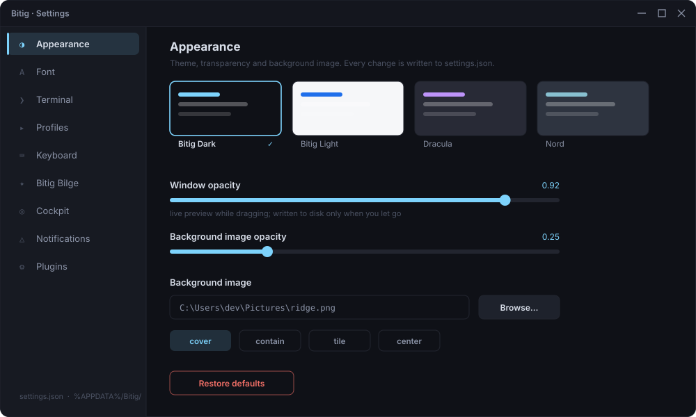

`Ctrl+,` or the gear in the title bar. Sliders preview instantly and write to
disk only when you let go, so dragging one does not hammer `settings.json`.
Everything the panel writes is plain JSON — nothing is locked behind the GUI.

### Shell profiles

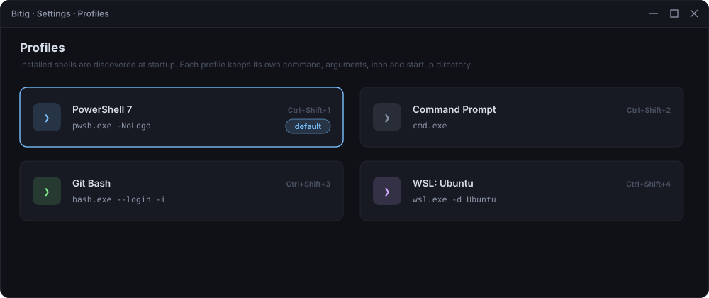

Installed shells are discovered at startup — PowerShell, Command Prompt, Git Bash
and every WSL distribution. Each profile keeps its own command, arguments, icon,
color and startup directory, and the first nine are one keystroke away
(`Ctrl+Shift+1..9`).

### Rebindable keyboard

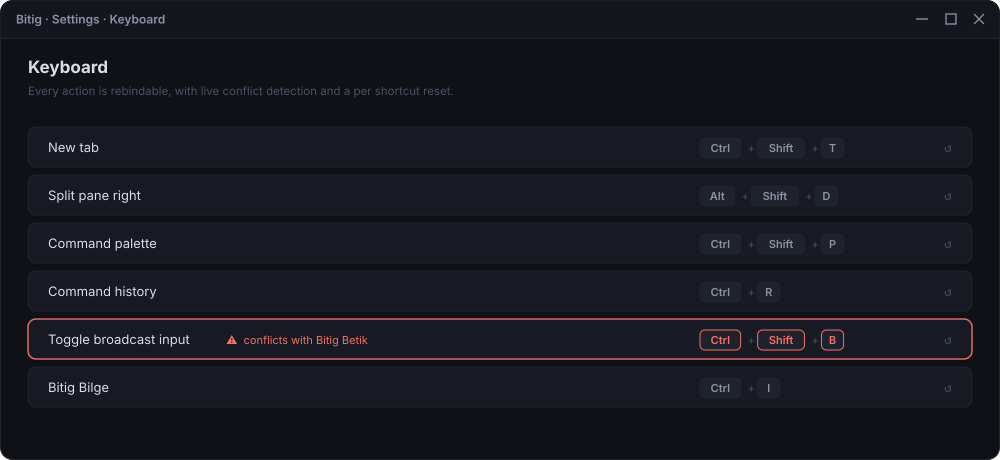

Every action resolves through one central registry, so every shortcut is
rebindable, conflicts are detected while you type them, and each binding has its
own reset.

### Fonts

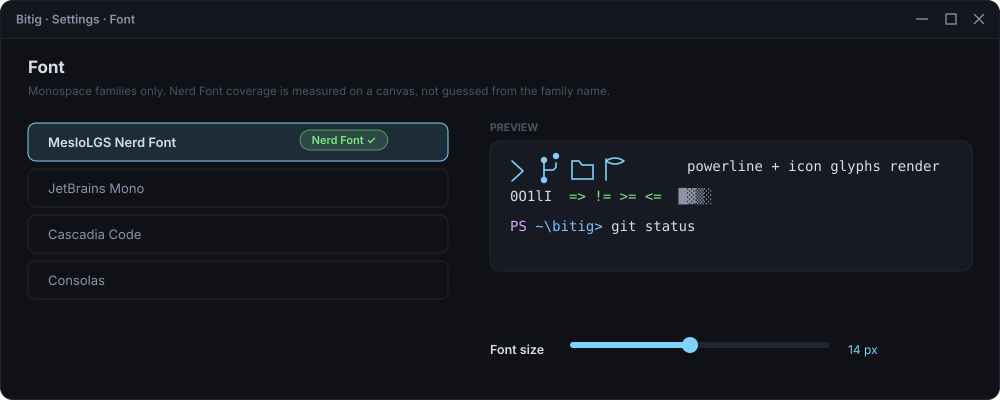

Only monospace families are listed, and **Nerd Font coverage is measured** by
rendering probe glyphs on a canvas against a reference code point — not guessed
from the family name, which is how most terminals get this wrong.

### Execution telemetry

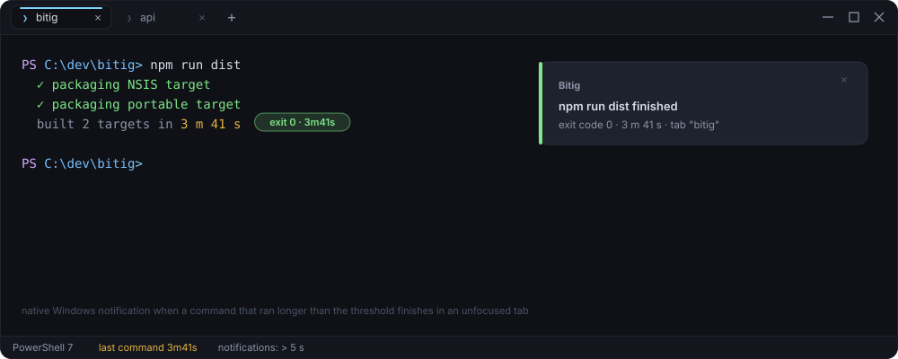

Bitig times every command. When one that ran longer than your threshold finishes
in a tab you are not looking at, you get a native Windows notification with the
exit code and the duration.

### Plugins

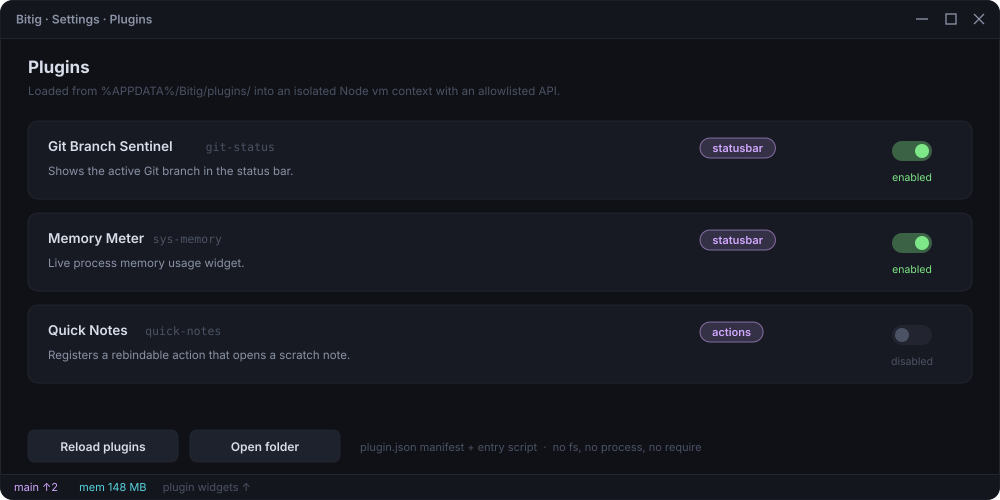

Each plugin is a folder under `%APPDATA%/Bitig/plugins/<id>/` with a
`plugin.json` manifest and an entry script. The script runs inside an isolated
Node `vm` context — no filesystem, no `process`, no `require` — and can only
reach the explicitly allowlisted `bitig` API. Plugins contribute status bar
widgets and rebindable actions. Three reference plugins ship out of the box.

---

## Keyboard shortcuts

Every binding below is rebindable from **Settings → Keyboard**.

<table>
<tr><td valign="top" width="50%">

**Tabs and panes**

| Shortcut | Action |
|---|---|
| `Ctrl+Shift+N` | New window |
| `Ctrl+Shift+T` | New tab |
| `Ctrl+Shift+W` | Close active tab |
| `Ctrl+Tab` / `Ctrl+Shift+Tab` | Next / previous tab |
| `Ctrl+Shift+1..9` | Open tab with profile 1 to 9 |
| `Alt+Shift+D` | Split focused pane right |
| `Alt+Shift+E` | Split focused pane down |
| `Ctrl+Shift+X` | Close focused pane |
| `Ctrl+Shift+Z` | Zoom / unzoom focused pane |
| `Alt+Arrow` / `Alt+H/J/K/L` | Navigate between panes |

</td><td valign="top" width="50%">

**Surfaces and modes**

| Shortcut | Action |
|---|---|
| `Ctrl+Shift+P` | Command palette |
| `Ctrl+Shift+B` | Bitig Betik (runbooks) |
| `Ctrl+R` | Fuzzy command history |
| `Ctrl+F` | In terminal search |
| `Ctrl+I` | Bitig Bilge (AI) |
| `Ctrl+,` | Toggle settings panel |
| `Alt+Shift+T` | Cycle themes |
| `Alt+Shift+I` | Toggle broadcast input |
| `Win+~` / `Ctrl+~` | Quake HUD window |
| `Tab` | Accept the inline suggestion |
| `Ctrl`/`Alt`+`→` | Accept the suggestion one word at a time |

</td></tr>
</table>

Mouse conveniences: middle click a tab to close it, drag to reorder, double click
a tab title to rename inline, right click the terminal for the context menu, and
click a port badge to open `localhost:PORT` in the browser.

---

## Customization

### Settings file

`%APPDATA%/Bitig/settings.json` is the source of truth. Hand editing works
identically to using the panel: changes are picked up within milliseconds via
`fs.watch`, debounced so a half written file never clobbers in memory state.

```jsonc
{
  "schemaVersion": 1,
  "activeTheme": "nord",
  "defaultProfileId": "powershell",
  "appearance": {
    "opacity": 0.92,
    "backgroundImage": "C:\\Users\\you\\Pictures\\bg.png",
    "backgroundImageOpacity": 0.25,
    "backgroundImageFit": "cover"
  },
  "terminal": {
    "fontFamily": "MesloLGS Nerd Font",
    "fontSize": 14,
    "scrollback": 10000,
    "copyOnSelect": true,
    "pasteOnRightClick": false,
    "confirmBeforeClose": true,
    "restoreSession": true,
    "showStatusBar": true
  },
  "telemetry": {
    "enableNotifications": true,
    "notificationThresholdMs": 5000
  },
  "cockpit": {
    "enablePortSniffer": true,
    "enableSecretShield": true,
    "openLinksInEditor": true
  }
}
```

### Snippets

Built in runbooks live in the app bundle; your own are stored in
`%APPDATA%/Bitig/snippets.json`. Use `{{variable_name}}` placeholders in the
`template` field and the Bitig Betik modal renders them as an interactive form
with a live command preview.

### Plugins

```jsonc
{
  "id": "git-status",
  "name": "Git Branch Sentinel",
  "version": "1.0.4",
  "description": "Shows the active Git branch in the status bar.",
  "author": "Bitig Team",
  "main": "main.js",
  "permissions": ["statusbar"]
}
```

```js
function updateGit() {
  const branch = bitig.getGitBranch();
  bitig.ui.setStatusBarWidget({
    id: 'git-branch',
    label: branch || 'Git',
    tooltip: 'Active Git branch',
    color: '#86efac'
  });
}

updateGit();
bitig.setInterval(updateGit, 2500);
```

Available surface: `bitig.ui.setStatusBarWidget`, `bitig.actions.register`,
`bitig.getGitBranch`, `bitig.getSystemMemory`, `bitig.openUrl`,
`bitig.setInterval`.

---

## Architecture

Three isolated processes, talking only through a narrow typed IPC surface. The
renderer never touches Node or native modules directly.

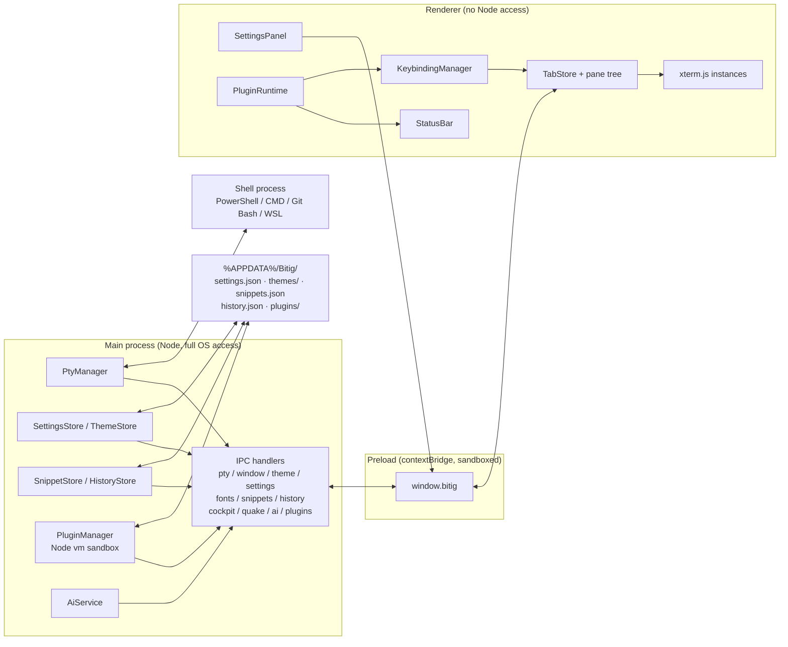

Every tab owns a pane tree (`src/renderer/src/panes.ts`): a single leaf by
default, or a nested tree of splits. Every leaf maps to exactly one `PtyManager`
session and one `xterm.js` instance. `TabStore` dispatches PTY events to the
correct leaf, feeds output into `PortSniffer` and `ExecutionTelemetry`, and keeps
the status bar in sync. `KeybindingManager` owns a central action registry and
resolves every shortcut, which is what makes both user rebinding and plugin
contributed actions possible without touching the calling code.

**Security posture** — `contextIsolation: true`, `nodeIntegration: false`,
`sandbox: true`, a content security policy in `index.html`, external links opened
through `shell.openExternal`, and native modules confined to the main process.

---

## IPC channel reference

Naming convention is `<domain>:<action>`. Each channel is declared once in
`src/shared/*.ts` and consumed by main, preload and renderer alike, so the
contract cannot silently drift between processes.

<details>
<summary><b>PTY and window</b></summary>

| Channel | Direction | Kind | Purpose |
|---|---|---|---|
| `pty:create` | renderer to main | invoke | Start a new PTY session, returns its id |
| `pty:write` | renderer to main | send | Forward keyboard input to the shell |
| `pty:resize` | renderer to main | send | Resize the PTY when the terminal is resized |
| `pty:dispose` | renderer to main | send | Kill a PTY session (tab or pane closing) |
| `pty:data` | main to renderer | event | Shell output chunk |
| `pty:exit` | main to renderer | event | Shell process exited |
| `window:minimize` | renderer to main | send | Minimize the window |
| `window:toggle-maximize` | renderer to main | send | Maximize or restore |
| `window:close` | renderer to main | send | Close the window |
| `window:is-maximized` | renderer to main | invoke | Query current maximize state |
| `window:maximize-change` | main to renderer | event | Maximize state changed |
| `window:notify` | renderer to main | send | Fire a native Windows desktop notification |
| `window:new-window` | renderer to main | send | Open a new, fully independent Bitig window |

All `pty:*` and `window:*` handlers are registered once per application and
resolve their target window from `event.sender`, so several windows can share the
same channels; `pty:data` and `pty:exit` are sent only to the window that owns
the session.

</details>

<details>
<summary><b>Appearance and settings</b></summary>

| Channel | Direction | Kind | Purpose |
|---|---|---|---|
| `theme:list` | renderer to main | invoke | Return every built in and user theme |
| `theme:list-changed` | main to renderer | event | A file in `themes/` was added, removed or edited |
| `settings:get` | renderer to main | invoke | Return the current settings object |
| `settings:set` | renderer to main | send | Apply a partial update (deep merged) |
| `settings:changed` | main to renderer | event | Broadcast full settings after any change |
| `settings:read-background-image` | renderer to main | invoke | Return background image as a `data:` URL |
| `settings:pick-background-image` | renderer to main | invoke | Open the native file picker |
| `settings:reset` | renderer to main | send | Reset all settings to defaults |
| `fonts:list` | renderer to main | invoke | List installed font families (cached) |

</details>

<details>
<summary><b>Productivity surfaces</b></summary>

| Channel | Direction | Kind | Purpose |
|---|---|---|---|
| `snippets:list` | renderer to main | invoke | List all runbook snippets |
| `snippets:save` | renderer to main | invoke | Create or update a snippet |
| `snippets:delete` | renderer to main | invoke | Delete a snippet by id |
| `snippets:reset` | renderer to main | invoke | Reset to the built in snippet library |
| `history:list` | renderer to main | invoke | List command history, frecency sorted |
| `history:add` | renderer to main | invoke | Record a completed command |
| `history:clear` | renderer to main | invoke | Clear all history |
| `cockpit:open-url` | renderer to main | invoke | Open a URL in the default browser |
| `cockpit:open-file` | renderer to main | invoke | Open a file in the configured editor at a line |
| `completion:context` | renderer to main | invoke | Project context for inline suggestions (`package.json` scripts, `Makefile` targets, directory entries), cached per directory by mtime |

</details>

<details>
<summary><b>Modes, AI and plugins</b></summary>

| Channel | Direction | Kind | Purpose |
|---|---|---|---|
| `quake:toggle` | renderer to main | invoke | Toggle the Quake HUD dropdown window |
| `quake:set-hotkey` | renderer to main | invoke | Rebind the global Quake OS shortcut |
| `ai:prompt` | renderer to main | invoke | Generate a CLI command from a natural language prompt |
| `ai:explain-error` | renderer to main | invoke | Explain a terminal error and suggest a resolution |
| `ai:test-connection` | renderer to main | invoke | Test connectivity to the configured AI endpoint |
| `plugin:list` | renderer to main | invoke | List discovered plugins with state and errors |
| `plugin:toggle` | renderer to main | invoke | Enable or disable a plugin |
| `plugin:reload` | renderer to main | invoke | Rescan and hot reload the plugins directory |
| `plugin:get-contributions` | renderer to main | invoke | Return status bar widgets and actions contributed by plugins |
| `plugin:contributions` | main to renderer | event | Broadcast contributions after a plugin updates a widget |
| `plugin:open-dir` | renderer to main | send | Open the plugins folder in Explorer |
| `plugin:execute-action` | renderer to main | send | Run a plugin registered action by id |

</details>

---

## Tech stack

| Layer | Choice | Why |
|---|---|---|
| App shell | [Electron](https://www.electronjs.org/) 43 | Mature desktop packaging and native OS integration on Windows |
| Build tooling | [electron-vite](https://electron-vite.org/) | Separate, sane build pipelines for main, preload and renderer |
| Terminal rendering | `@xterm/xterm` + fit, web-links, search | De facto standard terminal renderer for web and Electron apps |
| Shell processes | `node-pty` | Real ConPTY backed shells on Windows, N-API prebuilt binaries |
| Language | TypeScript (strict) | Type safety across process boundaries, catches IPC contract drift |
| Packaging | `electron-builder` | NSIS installer and portable target from one config |

---

## Building from source

Requires Windows 11, Node.js 20 or newer, and npm.

```
git clone https://github.com/sametgurtuna/bitig.git
cd bitig
npm install
```

| Command | Result |
|---|---|
| `npm run dev` | Vite dev server for the renderer plus a hot reloading Electron window |
| `npm run typecheck` | Strict TypeScript check across main, preload and renderer |
| `npm run build` | Production bundles under `out/` |
| `npm run pack` | Unpacked app directory under `dist/win-unpacked/` |
| `npm run dist` | Both Windows targets: NSIS setup and portable executable |
| `npm run dist:portable` | Portable executable only |
| `node scripts/make-readme-assets.mjs` | Regenerate the SVG previews in `assets/screenshots/` |

### Code signing

Release builds are signed when a certificate is supplied through the standard
electron-builder environment variables; without them the build still completes,
unsigned.

```powershell
# One time: create a local self signed certificate under build/ (gitignored)
.\scripts\make-cert.ps1

$env:CSC_LINK = "$PWD\build\bitig-codesign.pfx"
$env:CSC_KEY_PASSWORD = "<password>"
npm run dist
```

The signature and the `publisherName` in `electron-builder.yml` make **Samet
Gurtuna** the publisher shown in the installer and in Apps & Features. Note that
a self signed certificate does **not** remove the SmartScreen warning on first
run: Windows only trusts it if the certificate is imported into the machine's
Trusted Root store (`.\scripts\make-cert.ps1 -TrustLocally`, requires
administrator), and even a properly signed build needs to accumulate SmartScreen
reputation. Silencing it for everyone requires a commercial OV or EV code signing
certificate.

---

## Project structure

```
Bitig/
  electron-builder.yml        Windows packaging targets (nsis + portable), publisher
  electron.vite.config.ts     Build config for main / preload / renderer
  assets/
    banner.svg                README banner
    icon.ico / icon.png       App icon set
    screenshots/              Generated SVG previews used by this README
  scripts/
    make-cert.ps1             Generates a local self signed code signing certificate
    make-readme-assets.mjs    Generates assets/screenshots/*.svg
  src/
    shared/                   Typed IPC contracts, shared by all processes
      ptyTypes.ts               PTY channels
      windowTypes.ts            Window control channels
      themeTypes.ts             BitigTheme schema + theme channels
      settingsTypes.ts          BitigSettings schema + settings channels
      fontTypes.ts              Font enumeration channel
      snippetTypes.ts           Snippet schema + built in runbook library
      historyTypes.ts           History entry schema
      cockpitTypes.ts           DiscoveredPort + cockpit settings
      actionTypes.ts            Central action registry, default keybindings
      profileTypes.ts           ShellProfile schema + defaults
      quakeTypes.ts             Quake HUD settings
      aiTypes.ts                AI provider settings + prompt contracts
      pluginTypes.ts            Plugin manifest + contribution contracts
      completionTypes.ts        Inline suggestion project context contract
      builtinThemes/            bitigDark / bitigLight / dracula / nord
    main/
      index.ts                  App lifecycle, multi window management, clean shutdown
      pty/                      PTY session manager, shell auto discovery
        shellIntegration.ts     Injects the OSC 7 prompt hook per shell
      theme/                    Theme store, watches themes/
      settings/                 Settings store, watches settings.json
      snippets/ history/        Runbook and command history stores
      plugins/pluginManager.ts  Discovery, vm sandbox, reference plugin seeding
      ai/aiService.ts           Multi provider AI client (fetch based)
      ipc/                      One handler module per domain
    preload/
      index.ts                  contextBridge surface: window.bitig
    renderer/
      index.html
      src/
        main.ts                 Bootstrap, wires every top level module
        tabs.ts                 TabStore: tabs, pane routing, context menus
        panes.ts                Pane tree: split / close / render, divider drag
        appearance.ts           Applies theme, opacity, background image
        settingsPanel.ts        Settings GUI
        statusBar.ts            Bottom status bar and plugin widget host
        keybindings.ts          Action registry resolution, conflict detection
        commandPalette.ts       Ctrl+Shift+P
        betikModal.ts           Ctrl+Shift+B runbooks
        historyModal.ts         Ctrl+R history search
        bilgeModal.ts           Ctrl+I AI companion
        searchBar.ts            Ctrl+F in terminal search
        contextMenu.ts          Right click menu
        confirmModal.ts         Confirm before destructive close
        sessionManager.ts       Session persistence and restore
        pluginRuntime.ts        Bridges plugin contributions into the UI
        autocomplete.ts         Inline ghost text suggestion engine and overlay
        cwdTracker.ts           Prompt based working directory fallback
        portSniffer.ts          Live port detection from the PTY stream
        smartLinks.ts           file:line:col link provider
        secretShield.ts         Sensitive token detection and masking
        telemetry.ts            Command duration tracking and notifications
        fonts.ts                Monospace filtering and Nerd Font glyph probing
        fuzzy.ts                Fuzzy match scoring
        icons.ts                Single stroke SVG icon set
        titlebar.ts             Custom title bar behavior
        style.css               All UI styles
```

---

## Contributing

Fork the repository, keep each commit focused on one concern, and write commit
messages in English following the existing style. Run `npm run typecheck` before
opening a pull request. If you change the UI in a way the README shows, update
`scripts/make-readme-assets.mjs` and regenerate `assets/screenshots/`.
Architectural notes and per milestone design records live in
[`ROADMAP.md`](ROADMAP.md) and `CLAUDE.md`.

## Naming

"Bitig" is an Old Turkic word meaning "writing" or "written text". The name
follows the same tradition as the author's other projects, which draw on Turkic
mythology and Old Turkic vocabulary.

<div align="center" id="license">

---

**License:** [MIT](LICENSE) &nbsp;·&nbsp; Copyright (c) 2026 Samet Gurtuna

</div>
