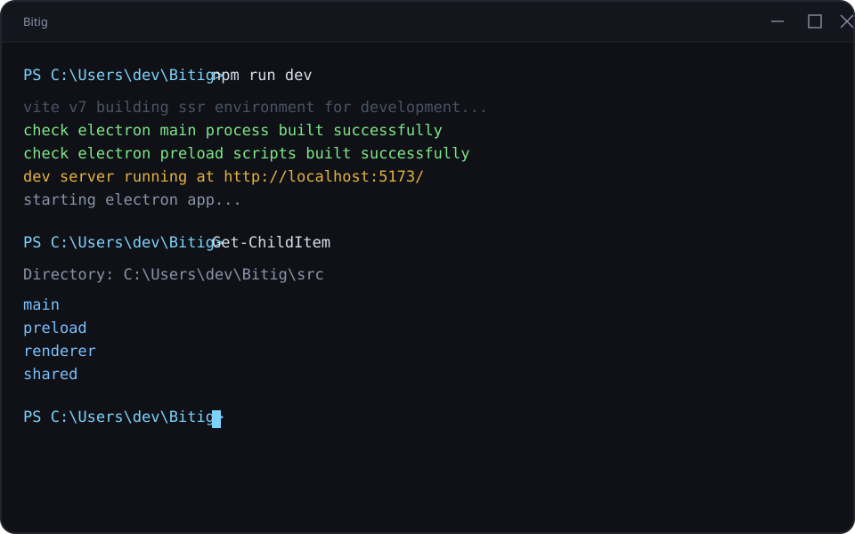
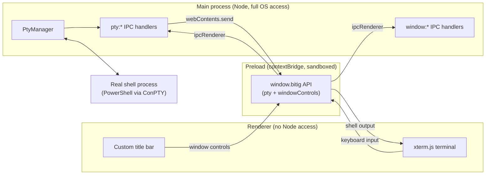
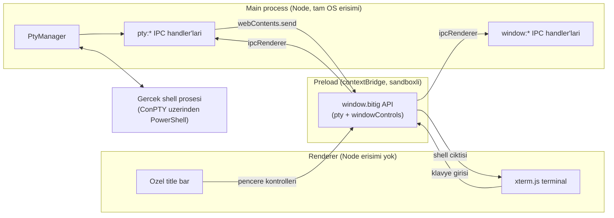

<div align="center">



# Bitig

**A terminal emulator for Windows, built from scratch.**
**Sifirdan yazilan, Windows icin bir terminal emulatoru.**

[](#)
[](#)
[](#)
[](#)
[](#)
[](#license--lisans)

**[English](#english)** &nbsp;|&nbsp; **[Turkce](#turkce)** &nbsp;|&nbsp; [Changelog](CHANGELOG.md)

</div>

---

<a id="english"></a>

# English

## Table of Contents

- [About](#about)
- [Features](#features)
- [Tech Stack](#tech-stack)
- [Architecture](#architecture)
- [IPC Channel Reference](#ipc-channel-reference)
- [Getting Started](#getting-started)
- [Project Structure](#project-structure)
- [Roadmap](#roadmap)
- [Contributing](#contributing)
- [Naming](#naming)

## About

Bitig is a desktop terminal emulator built for Windows 11, from the ground
up, as an alternative to Windows Terminal. It is not a fork or a theme on
top of an existing terminal; it is its own Electron application with its own
window chrome, its own rendering pipeline, and its own settings format.

The goal is a terminal that is visually customizable (themes, transparency,
custom title bar), fast to extend (a small, typed IPC surface between the
main and renderer processes), and eventually pluggable (a lightweight
extension system once the core is solid).

This project is under active, early development. The current milestone is a
working single-pane terminal: a real PowerShell process running behind a
custom window, rendered with xterm.js.

## Features

Shipped so far:

- Real Windows shell process (PowerShell) spawned through ConPTY via
  `node-pty`, with full keyboard input and live output streaming.
- xterm.js rendering with a hand-tuned color theme, block cursor bar, and
  scrollback buffer.
- A fully custom, frameless window: draggable title bar, minimize/maximize/
  close controls, rounded corners, and drop shadow, none of it borrowed from
  the OS chrome.
- A typed, one-way-clear IPC contract between the Electron main process and
  the renderer, exposed through a narrow `contextBridge` API (no direct
  Node access from the UI).
- Strict TypeScript across main, preload, and renderer, with a shared type
  layer for IPC payloads.

Planned, in order:

- [x] Working minimal terminal (window, PTY, rendering, keyboard input)
- [ ] Tabs (open, close, switch)
- [ ] Split panes (horizontal and vertical)
- [ ] Theme system (JSON based, built-in themes plus user themes)
- [ ] Transparency and background image support
- [ ] Settings panel (GUI, no manual JSON editing required)
- [ ] Nerd Font detection and font picker
- [ ] Customizable keyboard shortcuts
- [ ] Command history and fuzzy search
- [ ] Lightweight plugin system (dynamic JS loading)
- [ ] Packaging (installer via `electron-builder`)

## Tech Stack

| Layer | Choice | Why |
|---|---|---|
| App shell | [Electron](https://www.electronjs.org/) | Mature desktop packaging, native OS integration on Windows |
| Build tooling | [electron-vite](https://electron-vite.org/) | Separate, sane build pipelines for main, preload, and renderer |
| Terminal rendering | [`@xterm/xterm`](https://xtermjs.org/) + fit, web-links, search addons | The de facto standard terminal renderer for web/Electron apps |
| Shell process management | [`node-pty`](https://github.com/microsoft/node-pty) | Real ConPTY-backed shell processes on Windows, N-API prebuilt binaries |
| Language | TypeScript (strict) | Type safety across process boundaries, catches IPC contract drift |
| Package manager | npm | Standard, no extra tooling required |

## Architecture

Three isolated processes, talking only through a narrow, typed IPC surface.
The renderer never touches Node or native modules directly.



Every tab or pane will eventually map to one `PtyManager` session and one
`xterm.js` instance; the current prototype wires exactly one of each.

## IPC Channel Reference

Naming convention: `<domain>:<action>`. Defined once in
`src/shared/ptyTypes.ts` and `src/shared/windowTypes.ts`, consumed by main,
preload, and renderer alike, so the contract cannot silently drift between
processes.

| Channel | Direction | Kind | Purpose |
|---|---|---|---|
| `pty:create` | renderer to main | invoke | Start a new PTY session, returns its id |
| `pty:write` | renderer to main | send | Forward keyboard input to the shell |
| `pty:resize` | renderer to main | send | Resize the PTY when the terminal is resized |
| `pty:dispose` | renderer to main | send | Kill a PTY session (tab or pane closing) |
| `pty:data` | main to renderer | event | Shell output |
| `pty:exit` | main to renderer | event | Shell process exited |
| `window:minimize` | renderer to main | send | Minimize the window |
| `window:toggle-maximize` | renderer to main | send | Maximize or restore the window |
| `window:close` | renderer to main | send | Close the window |
| `window:is-maximized` | renderer to main | invoke | Query current maximize state |
| `window:maximize-change` | main to renderer | event | Notify the renderer when maximize state changes (OS-driven or otherwise) |

## Getting Started

### Prerequisites

- Windows 11
- [Node.js](https://nodejs.org/) 20 or newer
- npm (bundled with Node.js)

### Install

```
git clone https://github.com/<your-username>/bitig.git
cd bitig
npm install
```

### Run in development

```
npm run dev
```

This builds the main and preload bundles, starts a Vite dev server for the
renderer, and launches the Electron window with hot reload.

### Build

```
npm run build
```

Produces production bundles under `out/`.

## Project Structure

```
Bitig/
  electron.vite.config.ts   # Build config for main/preload/renderer
  tsconfig.json              # Renderer TypeScript config (strict)
  tsconfig.node.json         # Main + preload TypeScript config (strict)
  src/
    shared/
      ptyTypes.ts             # PTY IPC contract, shared across processes
      windowTypes.ts          # Window control IPC contract
    main/
      index.ts                # App lifecycle, BrowserWindow creation
      pty/ptyManager.ts       # PTY session lifecycle (create/write/resize/dispose)
      ipc/ptyHandlers.ts      # pty:* channel handlers
      ipc/windowHandlers.ts   # window:* channel handlers
    preload/
      index.ts                # contextBridge surface: window.bitig
    renderer/
      index.html
      src/
        main.ts                # xterm.js + FitAddon bootstrap
        titlebar.ts             # Custom title bar behavior
        theme.ts                # Terminal color theme
        style.css
```

## Roadmap

See the [Features](#features) checklist above for the full ordered list.
Progress and notable changes are tracked in [`CHANGELOG.md`](CHANGELOG.md).

## Contributing

This project is in an early, fast-moving stage; the architecture may still
shift as tabs and split panes land. If you want to experiment locally, fork
the repo, keep changes to one concern per commit, and write commit messages
in English, following the existing style.

## Naming

"Bitig" is an Old Turkic word meaning "writing" or "written text". The name
follows the same naming tradition as the author's other projects, which draw
on Turkic mythology and Old Turkic vocabulary.

<div align="right">

[Back to top](#bitig)

</div>

---

<a id="turkce"></a>

# Turkce

## Icindekiler

- [Proje Hakkinda](#proje-hakkinda)
- [Ozellikler](#ozellikler)
- [Teknik Yigin](#teknik-yigin)
- [Mimari](#mimari)
- [IPC Kanal Referansi](#ipc-kanal-referansi)
- [Baslarken](#baslarken)
- [Proje Yapisi](#proje-yapisi)
- [Yol Haritasi](#yol-haritasi)
- [Katkida Bulunma](#katkida-bulunma)
- [Isim Hakkinda](#isim-hakkinda)

## Proje Hakkinda

Bitig, Windows 11 icin sifirdan yazilan, Windows Terminal'e alternatif bir
masaustu terminal emulatoru. Var olan bir terminale eklenen bir tema ya da
fork degil; kendi pencere govdesi, kendi render hattı ve kendi ayar
formatiyla bagimsiz bir Electron uygulamasi.

Hedef: gorsel olarak ozellestirilebilir (temalar, seffaflik, ozel title bar),
genisletmesi kolay (main ve renderer surecleri arasinda kucuk ve tipli bir
IPC yuzeyi) ve zamanla eklenti destekli (cekirdek saglamlastiktan sonra
hafif bir eklenti sistemi) bir terminal.

Proje aktif ve erken gelistirme asamasinda. Su anki hedef: tek panelli,
calisan bir terminal - ozel bir pencerenin arkasinda calisan gercek bir
PowerShell prosesi, xterm.js ile render ediliyor.

## Ozellikler

Su ana kadar tamamlananlar:

- `node-pty` uzerinden ConPTY ile baslatilan gercek bir Windows shell
  prosesi (PowerShell); tam klavye girisi ve canli cikti akisi.
- Elle ayarlanmis renk temasi, blok imlec ve scrollback tamponuyla xterm.js
  render motoru.
- Tamamen ozel, cercevesiz (frameless) bir pencere: suruklenebilir title
  bar, minimize/maximize/close kontrolleri, yuvarlak koseler ve golge - hicbiri
  OS'nin varsayilan pencere govdesinden gelmiyor.
- Electron main sureci ile renderer arasinda tipli, tek yonu net bir IPC
  sozlesmesi; dar bir `contextBridge` API'siyle disari aciliyor (UI'dan
  dogrudan Node erisimi yok).
- Main, preload ve renderer'da strict TypeScript, IPC payload'lari icin
  paylasilan bir tip katmaniyla.

Sirasiyla planlananlar:

- [x] Calisan minimal terminal (pencere, PTY, render, klavye girisi)
- [ ] Sekmeler (ac, kapat, gecis yap)
- [ ] Split pane (yatay ve dikey bolme)
- [ ] Tema sistemi (JSON tabanli, hazir temalar + kullanici temalari)
- [ ] Seffaflik ve arkaplan gorseli destegi
- [ ] Ayarlar paneli (GUI, elle JSON duzenlemeye gerek kalmadan)
- [ ] Nerd Font tespiti ve font secici
- [ ] Ozellestirilebilir klavye kisayollari
- [ ] Komut gecmisi ve fuzzy arama
- [ ] Hafif eklenti sistemi (dinamik JS yukleme)
- [ ] Paketleme (`electron-builder` ile installer)

## Teknik Yigin

| Katman | Secim | Neden |
|---|---|---|
| Uygulama kabugu | [Electron](https://www.electronjs.org/) | Olgun masaustu paketleme, Windows'ta native entegrasyon |
| Build araci | [electron-vite](https://electron-vite.org/) | Main/preload/renderer icin ayri, duzenli build hatlari |
| Terminal render | [`@xterm/xterm`](https://xtermjs.org/) + fit, web-links, search eklentileri | Web/Electron uygulamalari icin fiili standart terminal render motoru |
| Shell proses yonetimi | [`node-pty`](https://github.com/microsoft/node-pty) | Windows'ta gercek ConPTY tabanli shell prosesleri, N-API hazir derlemeleriyle |
| Dil | TypeScript (strict) | Proses sinirlari arasinda tip guvenligi, IPC sozlesmesindeki sapmayi yakalar |
| Paket yoneticisi | npm | Standart, ekstra arac gerektirmiyor |

## Mimari

Uc izole proses, sadece dar ve tipli bir IPC yuzeyi uzerinden konusuyor.
Renderer hicbir zaman Node ya da native modullere dogrudan dokunmuyor.



Her sekme ya da pane, zamanla bir `PtyManager` oturumuna ve bir `xterm.js`
instance'ina karsilik gelecek; su anki prototip tam olarak bir tanesini
baglıyor.

## IPC Kanal Referansi

Isimlendirme kurali: `<alan>:<eylem>`. `src/shared/ptyTypes.ts` ve
`src/shared/windowTypes.ts` icinde bir kere tanimlanir, main/preload/renderer
tarafindan ortak kullanilir - bu sayede sozlesme surecler arasinda sessizce
kaymaz.

| Kanal | Yon | Tip | Amac |
|---|---|---|---|
| `pty:create` | renderer -> main | invoke | Yeni bir PTY oturumu baslatir, id doner |
| `pty:write` | renderer -> main | send | Klavye girisini shell'e iletir |
| `pty:resize` | renderer -> main | send | Terminal boyut degistiginde PTY'yi yeniden boyutlandirir |
| `pty:dispose` | renderer -> main | send | Bir PTY oturumunu sonlandirir (sekme/pane kapaninca) |
| `pty:data` | main -> renderer | event | Shell ciktisi |
| `pty:exit` | main -> renderer | event | Shell prosesi sonlandi |
| `window:minimize` | renderer -> main | send | Pencereyi kucultur |
| `window:toggle-maximize` | renderer -> main | send | Pencereyi buyutur ya da geri yukler |
| `window:close` | renderer -> main | send | Pencereyi kapatir |
| `window:is-maximized` | renderer -> main | invoke | Mevcut maximize durumunu sorgular |
| `window:maximize-change` | main -> renderer | event | Maximize durumu degistiginde renderer'i bilgilendirir (OS kaynakli dahil) |

## Baslarken

### On kosullar

- Windows 11
- [Node.js](https://nodejs.org/) 20 ya da uzeri
- npm (Node.js ile birlikte gelir)

### Kurulum

```
git clone https://github.com/<kullanici-adin>/bitig.git
cd bitig
npm install
```

### Gelistirme modunda calistirma

```
npm run dev
```

Bu komut main ve preload paketlerini derler, renderer icin bir Vite dev
server baslatir ve hot reload aktif sekilde Electron penceresini acar.

### Build alma

```
npm run build
```

Prodüksiyon paketlerini `out/` altinda uretir.

## Proje Yapisi

```
Bitig/
  electron.vite.config.ts   # main/preload/renderer icin build config'i
  tsconfig.json              # Renderer TypeScript config'i (strict)
  tsconfig.node.json         # Main + preload TypeScript config'i (strict)
  src/
    shared/
      ptyTypes.ts             # PTY IPC sozlesmesi, surecler arasi paylasilir
      windowTypes.ts          # Pencere kontrol IPC sozlesmesi
    main/
      index.ts                # App lifecycle, BrowserWindow olusturma
      pty/ptyManager.ts       # PTY oturum yasam dongusu (create/write/resize/dispose)
      ipc/ptyHandlers.ts      # pty:* kanal handler'lari
      ipc/windowHandlers.ts   # window:* kanal handler'lari
    preload/
      index.ts                # contextBridge yuzeyi: window.bitig
    renderer/
      index.html
      src/
        main.ts                # xterm.js + FitAddon kurulumu
        titlebar.ts             # Ozel title bar davranisi
        theme.ts                # Terminal renk temasi
        style.css
```

## Yol Haritasi

Tam siralı liste icin yukaridaki [Ozellikler](#ozellikler) bolumune bak.
Ilerleme ve onemli degisiklikler [`CHANGELOG.md`](CHANGELOG.md) dosyasinda
takip ediliyor.

## Katkida Bulunma

Proje erken ve hizli degisen bir asamada; sekmeler ve split pane eklendikce
mimari daha da degisebilir. Lokal olarak denemek istersen reposu fork'la,
her commit'i tek bir konuya odakla ve commit mesajlarini mevcut stile uygun
sekilde Ingilizce yaz.

## Isim Hakkinda

"Bitig", Eski Turkce'de "yazi" ya da "yazili metin" anlamina gelir. Isim,
yazarin diger projelerinde de takip ettigi, Turk mitolojisi ve Eski Turkce
kelime dagarcigina dayanan isimlendirme gelenegini surdurur.

<div align="right">

[Basa don / Back to top](#bitig)

</div>

---

<div align="center" id="license--lisans">

**License / Lisans:** [ISC](package.json)

</div>
