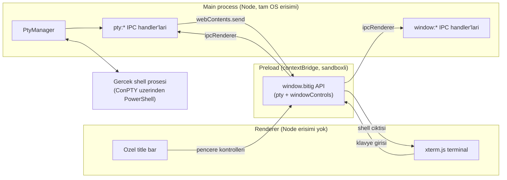

<div align="center">


# Bitig

**Sifirdan yazilan, Windows icin bir terminal emulatoru.**

Ozel arayuz, gercek ConPTY shell'leri ve sekme/pane/tema/eklenti icin bir temel.

[](#)
[](#)
[](#)
[](#)
[](#)
[](#lisans)

[English](README.md) &nbsp;|&nbsp; [Changelog](CHANGELOG.md)

</div>

---

## Icindekiler

- [Proje Hakkinda](#proje-hakkinda)
- [Ozellikler](#ozellikler)
- [Teknik Yigin](#teknik-yigin)
- [Mimari](#mimari)
- [IPC Kanal Referansi](#ipc-kanal-referansi)
- [Baslarken](#baslarken)
- [Proje Yapisi](#proje-yapisi)
- [Yol Haritasi](#yol-haritasi)
- [Katkida Bulunma](#katkida-bulunma)
- [Isim Hakkinda](#isim-hakkinda)
- [Lisans](#lisans)

## Proje Hakkinda

Bitig, Windows 11 icin sifirdan yazilan, Windows Terminal'e alternatif bir
masaustu terminal emulatoru. Var olan bir terminale eklenen bir tema ya da
fork degil; kendi pencere govdesi, kendi render hattı ve kendi ayar
formatiyla bagimsiz bir Electron uygulamasi.

Hedef: gorsel olarak ozellestirilebilir (temalar, seffaflik, ozel title bar),
genisletmesi kolay (main ve renderer surecleri arasinda kucuk ve tipli bir
IPC yuzeyi) ve zamanla eklenti destekli (cekirdek saglamlastiktan sonra
hafif bir eklenti sistemi) bir terminal.

Proje aktif ve erken gelistirme asamasinda. Su anki hedef: tek panelli,
calisan bir terminal - ozel bir pencerenin arkasinda calisan gercek bir
PowerShell prosesi, xterm.js ile render ediliyor.

## Ozellikler

Su ana kadar tamamlananlar:

- `node-pty` uzerinden ConPTY ile baslatilan gercek bir Windows shell
  prosesi (PowerShell); tam klavye girisi ve canli cikti akisi.
- Elle ayarlanmis renk temasi, blok imlec ve scrollback tamponuyla xterm.js
  render motoru.
- Tamamen ozel, cercevesiz (frameless) bir pencere: suruklenebilir title
  bar, minimize/maximize/close kontrolleri, yuvarlak koseler ve golge - hicbiri
  OS'nin varsayilan pencere govdesinden gelmiyor.
- Electron main sureci ile renderer arasinda tipli, tek yonu net bir IPC
  sozlesmesi; dar bir `contextBridge` API'siyle disari aciliyor (UI'dan
  dogrudan Node erisimi yok).
- Main, preload ve renderer'da strict TypeScript, IPC payload'lari icin
  paylasilan bir tip katmaniyla.

Sirasiyla planlananlar:

- [x] Calisan minimal terminal (pencere, PTY, render, klavye girisi)
- [ ] Sekmeler (ac, kapat, gecis yap)
- [ ] Split pane (yatay ve dikey bolme)
- [ ] Tema sistemi (JSON tabanli, hazir temalar + kullanici temalari)
- [ ] Seffaflik ve arkaplan gorseli destegi
- [ ] Ayarlar paneli (GUI, elle JSON duzenlemeye gerek kalmadan)
- [ ] Nerd Font tespiti ve font secici
- [ ] Ozellestirilebilir klavye kisayollari
- [ ] Komut gecmisi ve fuzzy arama
- [ ] Hafif eklenti sistemi (dinamik JS yukleme)
- [ ] Paketleme (`electron-builder` ile installer)

## Teknik Yigin

| Katman | Secim | Neden |
|---|---|---|
| Uygulama kabugu | [Electron](https://www.electronjs.org/) | Olgun masaustu paketleme, Windows'ta native entegrasyon |
| Build araci | [electron-vite](https://electron-vite.org/) | Main/preload/renderer icin ayri, duzenli build hatlari |
| Terminal render | [`@xterm/xterm`](https://xtermjs.org/) + fit, web-links, search eklentileri | Web/Electron uygulamalari icin fiili standart terminal render motoru |
| Shell proses yonetimi | [`node-pty`](https://github.com/microsoft/node-pty) | Windows'ta gercek ConPTY tabanli shell prosesleri, N-API hazir derlemeleriyle |
| Dil | TypeScript (strict) | Proses sinirlari arasinda tip guvenligi, IPC sozlesmesindeki sapmayi yakalar |
| Paket yoneticisi | npm | Standart, ekstra arac gerektirmiyor |

## Mimari

Uc izole proses, sadece dar ve tipli bir IPC yuzeyi uzerinden konusuyor.
Renderer hicbir zaman Node ya da native modullere dogrudan dokunmuyor.



Her sekme ya da pane, zamanla bir `PtyManager` oturumuna ve bir `xterm.js`
instance'ina karsilik gelecek; su anki prototip tam olarak bir tanesini
baglıyor.

## IPC Kanal Referansi

Isimlendirme kurali: `<alan>:<eylem>`. `src/shared/ptyTypes.ts` ve
`src/shared/windowTypes.ts` icinde bir kere tanimlanir, main/preload/renderer
tarafindan ortak kullanilir - bu sayede sozlesme surecler arasinda sessizce
kaymaz.

| Kanal | Yon | Tip | Amac |
|---|---|---|---|
| `pty:create` | renderer -> main | invoke | Yeni bir PTY oturumu baslatir, id doner |
| `pty:write` | renderer -> main | send | Klavye girisini shell'e iletir |
| `pty:resize` | renderer -> main | send | Terminal boyut degistiginde PTY'yi yeniden boyutlandirir |
| `pty:dispose` | renderer -> main | send | Bir PTY oturumunu sonlandirir (sekme/pane kapaninca) |
| `pty:data` | main -> renderer | event | Shell ciktisi |
| `pty:exit` | main -> renderer | event | Shell prosesi sonlandi |
| `window:minimize` | renderer -> main | send | Pencereyi kucultur |
| `window:toggle-maximize` | renderer -> main | send | Pencereyi buyutur ya da geri yukler |
| `window:close` | renderer -> main | send | Pencereyi kapatir |
| `window:is-maximized` | renderer -> main | invoke | Mevcut maximize durumunu sorgular |
| `window:maximize-change` | main -> renderer | event | Maximize durumu degistiginde renderer'i bilgilendirir (OS kaynakli dahil) |

## Baslarken

### On kosullar

- Windows 11
- [Node.js](https://nodejs.org/) 20 ya da uzeri
- npm (Node.js ile birlikte gelir)

### Kurulum

```
git clone https://github.com/<kullanici-adin>/bitig.git
cd bitig
npm install
```

### Gelistirme modunda calistirma

```
npm run dev
```

Bu komut main ve preload paketlerini derler, renderer icin bir Vite dev
server baslatir ve hot reload aktif sekilde Electron penceresini acar.

### Build alma

```
npm run build
```

Prodüksiyon paketlerini `out/` altinda uretir.

## Proje Yapisi

```
Bitig/
  electron.vite.config.ts   # main/preload/renderer icin build config'i
  tsconfig.json              # Renderer TypeScript config'i (strict)
  tsconfig.node.json         # Main + preload TypeScript config'i (strict)
  src/
    shared/
      ptyTypes.ts             # PTY IPC sozlesmesi, surecler arasi paylasilir
      windowTypes.ts          # Pencere kontrol IPC sozlesmesi
    main/
      index.ts                # App lifecycle, BrowserWindow olusturma
      pty/ptyManager.ts       # PTY oturum yasam dongusu (create/write/resize/dispose)
      ipc/ptyHandlers.ts      # pty:* kanal handler'lari
      ipc/windowHandlers.ts   # window:* kanal handler'lari
    preload/
      index.ts                # contextBridge yuzeyi: window.bitig
    renderer/
      index.html
      src/
        main.ts                # xterm.js + FitAddon kurulumu
        titlebar.ts             # Ozel title bar davranisi
        theme.ts                # Terminal renk temasi
        style.css
```

## Yol Haritasi

Tam siralı liste icin yukaridaki [Ozellikler](#ozellikler) bolumune bak.
Ilerleme ve onemli degisiklikler [`CHANGELOG.md`](CHANGELOG.md) dosyasinda
takip ediliyor.

## Katkida Bulunma

Proje erken ve hizli degisen bir asamada; sekmeler ve split pane eklendikce
mimari daha da degisebilir. Lokal olarak denemek istersen reposu fork'la,
her commit'i tek bir konuya odakla ve commit mesajlarini mevcut stile uygun
sekilde Ingilizce yaz.

## Isim Hakkinda

"Bitig", Eski Turkce'de "yazi" ya da "yazili metin" anlamina gelir. Isim,
yazarin diger projelerinde de takip ettigi, Turk mitolojisi ve Eski Turkce
kelime dagarcigina dayanan isimlendirme gelenegini surdurur.

## Lisans

[ISC](package.json)
